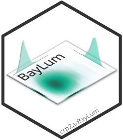

<!-- README.md was auto-generated by README.Rmd. Please DO NOT edit by hand!-->

```{r, echo = FALSE, message=FALSE}
knitr::opts_chunk$set(
  collapse = TRUE,
  comment = "#>",
  fig.path = "man/figures/README-"
)
library(BayLum)
```
 
# BayLum 

<!-- badges: start -->
[](https://github.com/crp2a/BayLum/actions/workflows/R-CMD-check.yaml)
[](https://app.codecov.io/gh/crp2a/BayLum)

[](https://crp2a.r-universe.dev/BayLum)
[](https://cran.r-project.org/package=BayLum)
[](https://cran.r-project.org/web/checks/check_results_BayLum.html)
[](https://cran.r-project.org/package=BayLum)

[](https://www.repostatus.org/#active)

[](https://doi.org/10.5281/zenodo.4311266)
[](https://doi.org/10.32614/CRAN.package.BayLum)
<!-- badges: end -->

An R package for chronological **Bay**esian models integrated for Optically Stimulated (OSL) **Lum**inescence Dating

```{r citation, echo=FALSE, comment=''}
cite <- utils::citation("BayLum")
print(cite, bibtex = FALSE)
```

## Installation

**You need to have [JAGS](https://mcmc-jags.sourceforge.io) installed on your computer.**

You can install the released version of **BayLum** from [CRAN](https://CRAN.R-project.org) with:

```{r cran-installation, eval=FALSE}
install.packages("BayLum")
```

And the development version from [GitHub](https://github.com/) with:

```{r gh-installation, eval=FALSE}
# install.packages("remotes")
remotes::install_github("crp2a/BayLum")
```

Please note that development versions may change day by day.

## License

This program is free software: you can redistribute it and/or modify it under the terms of the GNU General Public License as published by the Free Software Foundation, either version 3 of the License, or any later version.

This program is distributed in the hope that it will be useful, but WITHOUT ANY WARRANTY; without even the implied warranty of MERCHANTABILITY or FITNESS FOR A PARTICULAR PURPOSE. See the GNU General Public License for more details.

## Acknowledgements

The development of **BayLum** received a state financial support managed by the Agence Nationale de la Recherche (France) through the program *Investissements d'avenir* (ref. ANR-10-LABX-52) between 2015 and 2018.
