# BayLum: An Introduction

## Introduction

`'BayLum'` provides a collection of various **R** functions for Bayesian
analysis of luminescence data. Amongst others, this includes data
import, export, application of age models and palaeodose modelling.

Data can be processed simultaneously for various samples, including the
input of multiple BIN/BINX-files per sample for single grain (SG) or
multi-grain (MG) OSL measurements. Stratigraphic constraints and
systematic errors can be added to constrain the analysis further.

For those who already know how to use **R**, `'BayLum'` won’t be
difficult to use, for all others, this brief introduction may be of help
to make the first steps with **R** and the package `'BayLum'` as
convenient as possible.

### Installing \`BayLum’ package

If you read this document before having installed **R** itself, you
should first visit the [R project](https://www.r-project.org) website
and download and install **R**. You may also consider installing
[Rstudio](https://posit.co), which provides an excellent desktop working
environment for **R**; however it is not a prerequisite.

You will also need the external software *JAGS* (Just Another Gibs
Sampler). Please visit the [JAGS](https://mcmc-jags.sourceforge.io)
webpage and follow the installation instructions. Now you are nearly
ready to work with ‘BayLum’.

If you have not yet installed ‘BayLum’, please run the following two
**R** code lines to install ‘BayLum’ on your computer.

``` r
install.packages("BayLum", dependencies = TRUE)
```

Alternatively, you can load an already installed **R** package (here
‘BayLum’) into your session by using the following **R** call.

``` r
library(BayLum)
```

## First steps: age analysis of one sample

Measurement data can be imported using two different options as detailed
in the following:

- Option 1: Using the conventional ‘BayLum’ folder structure (old)
- Option 2: Using a single-setting config file (new)

### Option 1: Import information from a BIN/BINX-file.

Let us consider the sample named *samp1*, which is the example dataset
coming with the package. All information related to this sample is
stored in a subfolder called also *samp1*. To test the package example,
first, we add the path of the example dataset to the object `path`.

``` r
path <- paste0(system.file("extdata/", package = "BayLum"), "/")
```

Please note that for your own dataset (i.e. not included in the package)
you have to replace this call by something like:

``` r
path <- "Users/Master_of_luminescence/Documents/MyFamousOSLData"
```

In our example the folder contains the following subfolders and files:

|     |                           |
|:----|:--------------------------|
| 1   | example.yml               |
| 2   | FER1/bin.bin              |
| 3   | FER1/Disc.csv             |
| 4   | FER1/DoseEnv.csv          |
| 5   | FER1/DoseSource.csv       |
| 6   | FER1/rule.csv             |
| 7   | samp1/bin.bin             |
| 8   | samp1/DiscPos.csv         |
| 9   | samp1/DoseEnv.csv         |
| 10  | samp1/DoseSource.csv      |
| 11  | samp1/rule.csv            |
| 12  | samp2/bin.bin             |
| 13  | samp2/DiscPos.csv         |
| 14  | samp2/DoseEnv.csv         |
| 15  | samp2/DoseSource.csv      |
| 16  | samp2/rule.csv            |
| 17  | yaml_config_reference.yml |

See *“What are the required files in each subfolder?”* in the manual of
[`Generate_DataFile()`](https://crp2a.github.io/BayLum/dev/reference/Generate_DataFile-deprecated.md)
function for the meaning of these files.

To import your data, simply call the function
[`Generate_DataFile()`](https://crp2a.github.io/BayLum/dev/reference/Generate_DataFile-deprecated.md):

``` r
DATA1 <-
  Generate_DataFile(
    Path = path,
    FolderNames = "samp1",
    Nb_sample = 1,
    verbose = FALSE)
```

    Warning in Generate_DataFile(Path = path, FolderNames = "samp1", Nb_sample = 1, : 'Generate_DataFile' is deprecated.
    Use 'create_DataFile()' instead.
    See help("Deprecated")

    Error in `Luminescence::read_BIN2R(file = paste0(Path, FolderNames[bf]), duplicated.rm = read_BIN2R.settings$duplicated.rm,
      verbose = read_BIN2R.settings$verbose)[[1]]`:
    ! this S4 class is not subsettable

#### Remarks

##### Data import/export

The import may take a while, in particular for large BIN/BINX-files.
This can become annoying if you want to play with the data. In such
situations, it makes sense to save your imported data somewhere else
before continuing.

To save the obove imported data on your hardrive use

``` r
save(DATA1, file = "YourPath/DATA1.RData")
```

To load the data use

``` r
load(DATA1, file = "YourPath/DATA1.RData")
```

##### Data structure

To see the overall structure of the data generated from the
BIN/BINX-file and the associated CSV-files, the following call can be
used:

``` r
str(DATA1)
```

    List of 11
     $ LT            :List of 1
      ..$ : num [1:101, 1:6] 5.66 6.9 4.05 3.43 4.97 ...
     $ sLT           :List of 1
      ..$ : num [1:101, 1:6] 0.373 0.315 0.245 0.181 0.246 ...
     $ ITimes        :List of 1
      ..$ : num [1:101, 1:5] 160 160 160 160 160 160 160 160 160 160 ...
     $ dLab          : num [1:2, 1] 1.53e-01 5.89e-05
     $ ddot_env      : num [1:2, 1] 2.26 0.0617
     $ regDose       :List of 1
      ..$ : num [1:101, 1:5] 24.6 24.6 24.6 24.6 24.6 ...
     $ J             : num 101
     $ K             : num 5
     $ Nb_measurement: num 14
     $ SampleNames   : chr "samp 1"
     $ Nb_sample     : num 1
     - attr(*, "originator")= chr "create_DataFile"

It reveals that `DATA1` is basically a list with 11 elements:

| Element                | Content                                           |
|------------------------|---------------------------------------------------|
| `DATA1$LT`             | $L_{x}$/$T_{x}$ values from each sample           |
| `DATA1$sLT`            | $L_{x}$/$T_{x}$ error values from each sample     |
| `DATA1$ITimes`         | Irradiation times                                 |
| `DATA1$dLab`           | The lab dose rate                                 |
| `DATA1$ddot_env`       | The environmental dose rate and its variance      |
| `DATA1$regDose`        | The regenerated dose points                       |
| `DATA1$J`              | The number of aliquots selected for each BIN-file |
| `DATA1$K`              | The number of regenerated dose points             |
| `DATA1$Nb_measurement` | The number of measurements per BIN-file           |

##### Visualise Lx/Tx values and dose points

To get an impression on how your data look like, you can visualise them
by using the function
[`LT_RegenDose()`](https://crp2a.github.io/BayLum/dev/reference/LT_RegenDose-deprecated.md):

``` r
LT_RegenDose(
  DATA = DATA1,
  Path = path,
  FolderNames = "samp1",
  SampleNames = "samp1",
  Nb_sample = 1,
  nrow = NULL
)
```

    Warning in LT_RegenDose(DATA = DATA1, Path = path, FolderNames = "samp1", : 'LT_RegenDose' is deprecated.
    Use 'plot_RegDosePoints()' instead.
    See help("Deprecated")


plot of chunk unnamed-chunk-10


plot of chunk unnamed-chunk-10


plot of chunk unnamed-chunk-10


plot of chunk unnamed-chunk-10


plot of chunk unnamed-chunk-10

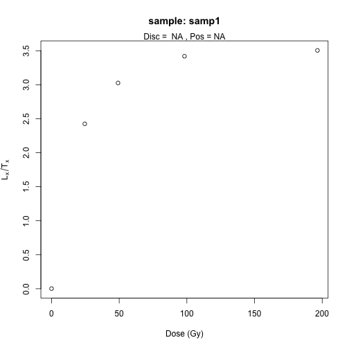

plot of chunk unnamed-chunk-10


plot of chunk unnamed-chunk-10


plot of chunk unnamed-chunk-10


plot of chunk unnamed-chunk-10

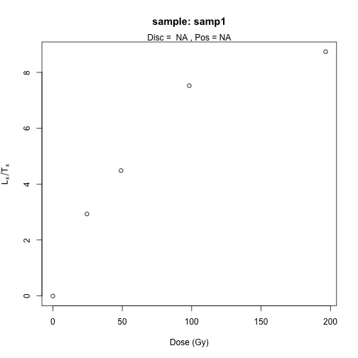

plot of chunk unnamed-chunk-10


plot of chunk unnamed-chunk-10

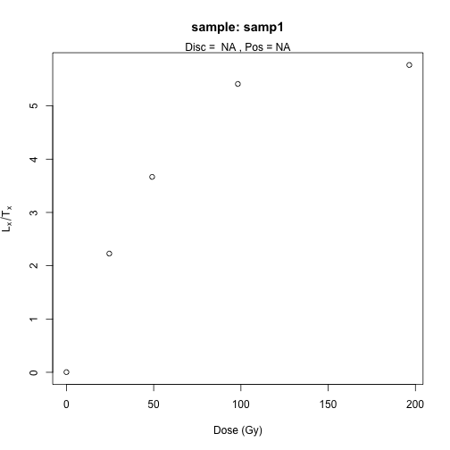

plot of chunk unnamed-chunk-10


plot of chunk unnamed-chunk-10


plot of chunk unnamed-chunk-10


plot of chunk unnamed-chunk-10


plot of chunk unnamed-chunk-10


plot of chunk unnamed-chunk-10


plot of chunk unnamed-chunk-10


plot of chunk unnamed-chunk-10


plot of chunk unnamed-chunk-10

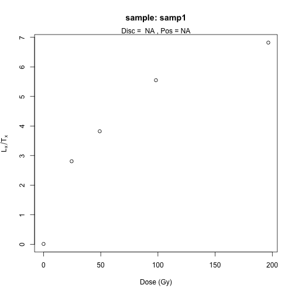

plot of chunk unnamed-chunk-10

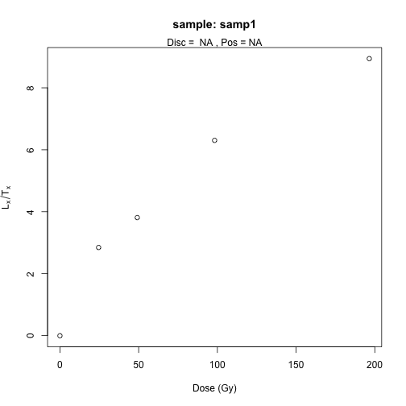

plot of chunk unnamed-chunk-10


plot of chunk unnamed-chunk-10

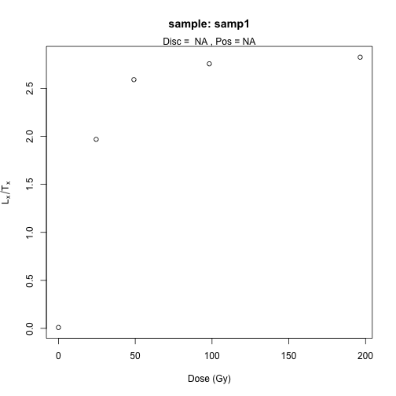

plot of chunk unnamed-chunk-10

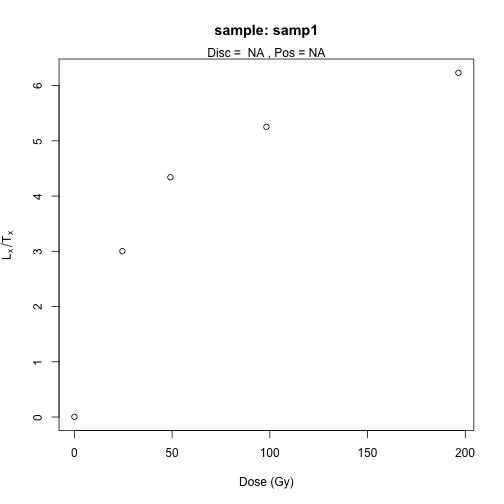

plot of chunk unnamed-chunk-10


plot of chunk unnamed-chunk-10


plot of chunk unnamed-chunk-10


plot of chunk unnamed-chunk-10


plot of chunk unnamed-chunk-10


plot of chunk unnamed-chunk-10


plot of chunk unnamed-chunk-10

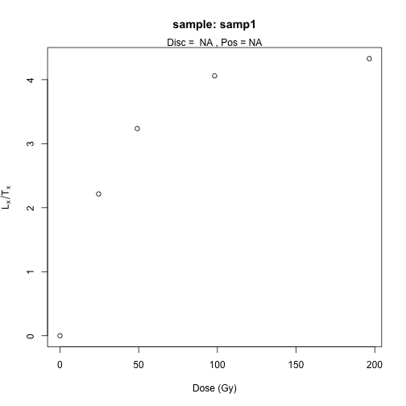

plot of chunk unnamed-chunk-10


plot of chunk unnamed-chunk-10


plot of chunk unnamed-chunk-10


plot of chunk unnamed-chunk-10


plot of chunk unnamed-chunk-10


plot of chunk unnamed-chunk-10


plot of chunk unnamed-chunk-10


plot of chunk unnamed-chunk-10

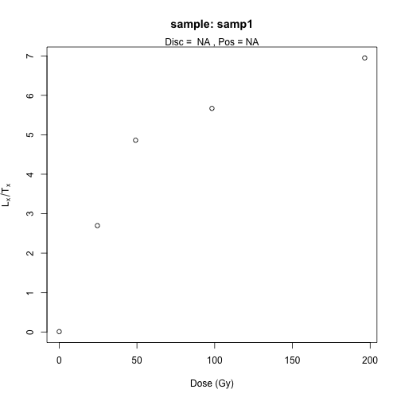

plot of chunk unnamed-chunk-10

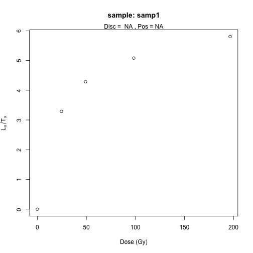

plot of chunk unnamed-chunk-10

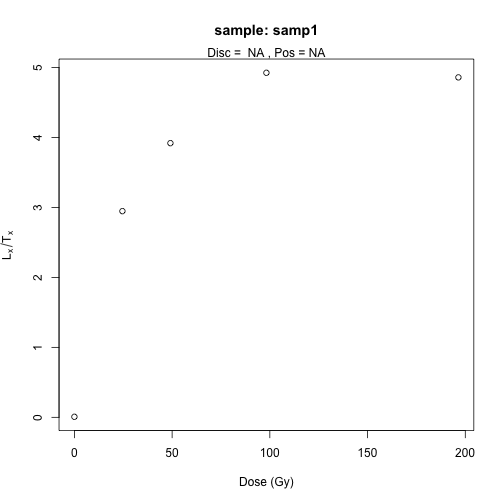

plot of chunk unnamed-chunk-10

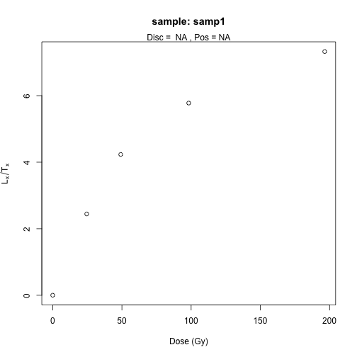

plot of chunk unnamed-chunk-10


plot of chunk unnamed-chunk-10


plot of chunk unnamed-chunk-10


plot of chunk unnamed-chunk-10

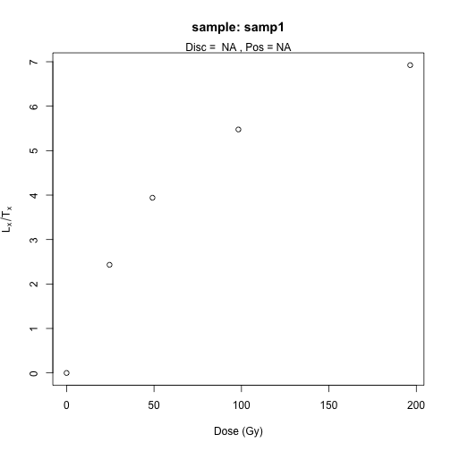

plot of chunk unnamed-chunk-10


plot of chunk unnamed-chunk-10


plot of chunk unnamed-chunk-10


plot of chunk unnamed-chunk-10


plot of chunk unnamed-chunk-10


plot of chunk unnamed-chunk-10

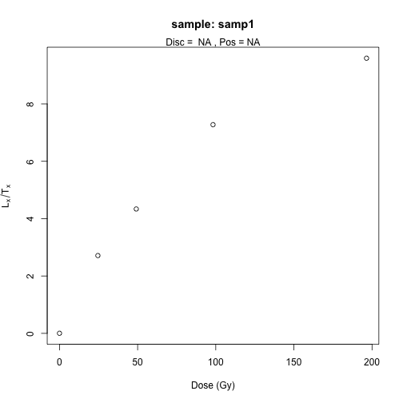

plot of chunk unnamed-chunk-10

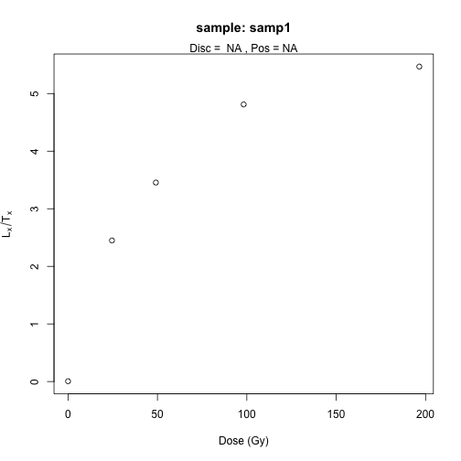

plot of chunk unnamed-chunk-10


plot of chunk unnamed-chunk-10

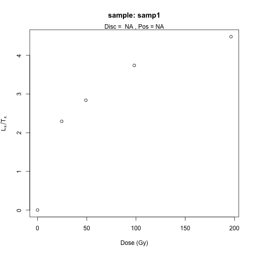

plot of chunk unnamed-chunk-10

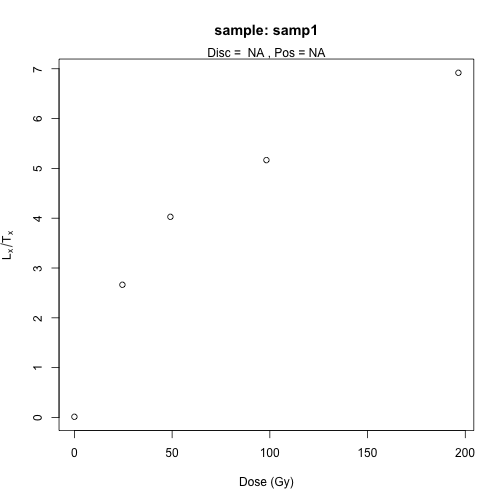

plot of chunk unnamed-chunk-10

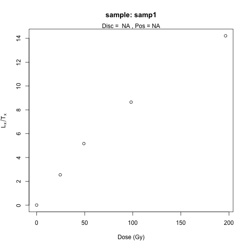

plot of chunk unnamed-chunk-10


plot of chunk unnamed-chunk-10

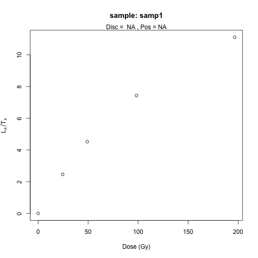

plot of chunk unnamed-chunk-10


plot of chunk unnamed-chunk-10


plot of chunk unnamed-chunk-10

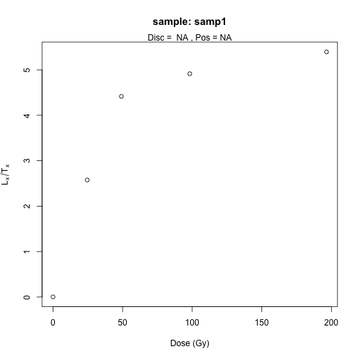

plot of chunk unnamed-chunk-10


plot of chunk unnamed-chunk-10


plot of chunk unnamed-chunk-10


plot of chunk unnamed-chunk-10


plot of chunk unnamed-chunk-10

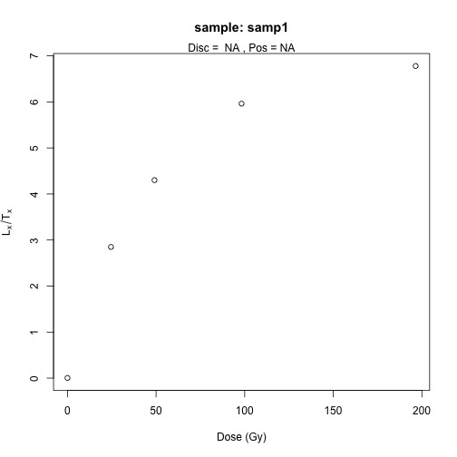

plot of chunk unnamed-chunk-10

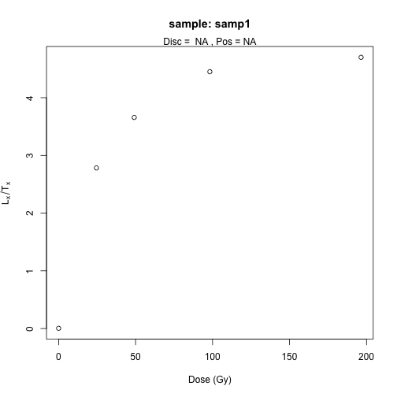

plot of chunk unnamed-chunk-10

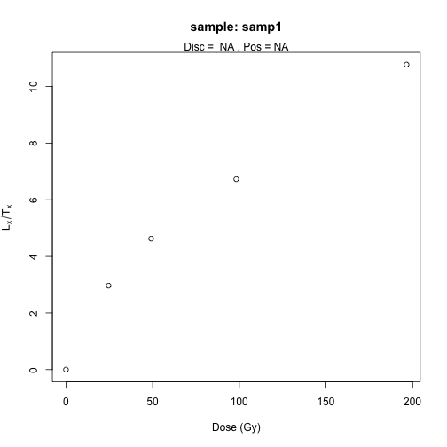

plot of chunk unnamed-chunk-10


plot of chunk unnamed-chunk-10


plot of chunk unnamed-chunk-10

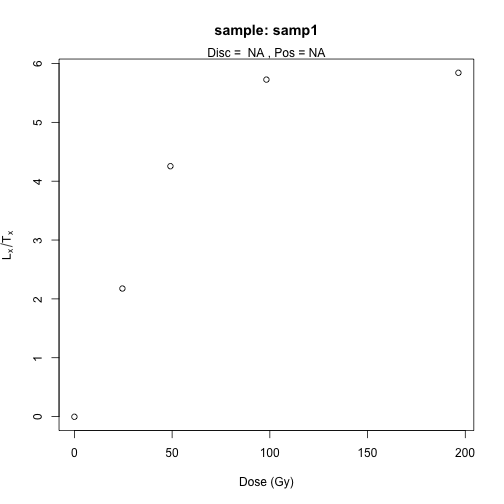

plot of chunk unnamed-chunk-10


plot of chunk unnamed-chunk-10


plot of chunk unnamed-chunk-10


plot of chunk unnamed-chunk-10


plot of chunk unnamed-chunk-10


plot of chunk unnamed-chunk-10


plot of chunk unnamed-chunk-10


plot of chunk unnamed-chunk-10

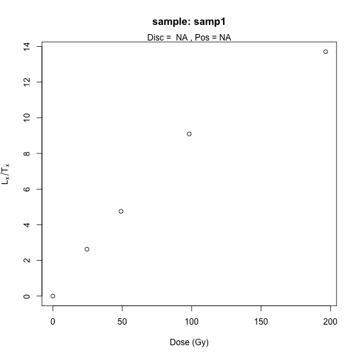

plot of chunk unnamed-chunk-10


plot of chunk unnamed-chunk-10


plot of chunk unnamed-chunk-10

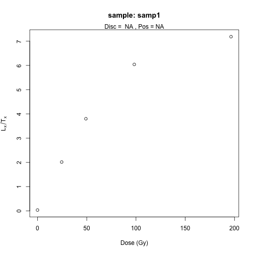

plot of chunk unnamed-chunk-10


plot of chunk unnamed-chunk-10


plot of chunk unnamed-chunk-10

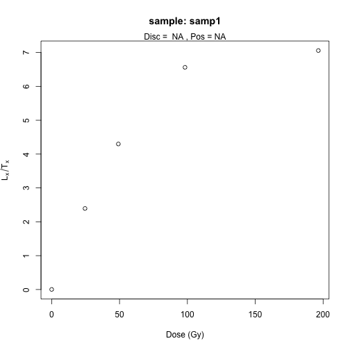

plot of chunk unnamed-chunk-10


plot of chunk unnamed-chunk-10

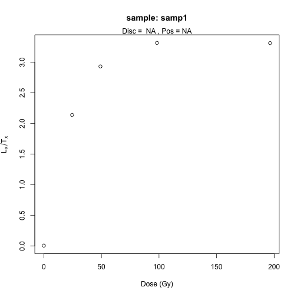

plot of chunk unnamed-chunk-10

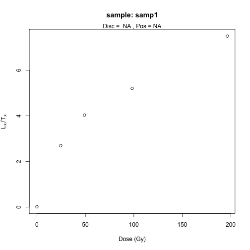

plot of chunk unnamed-chunk-10


plot of chunk unnamed-chunk-10


plot of chunk unnamed-chunk-10


plot of chunk unnamed-chunk-10


plot of chunk unnamed-chunk-10


plot of chunk unnamed-chunk-10


plot of chunk unnamed-chunk-10

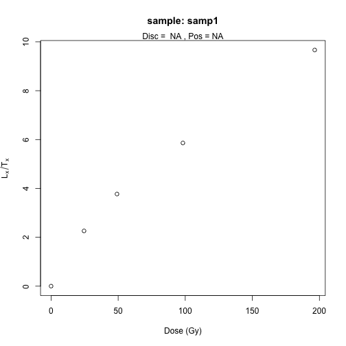

plot of chunk unnamed-chunk-10


plot of chunk unnamed-chunk-10

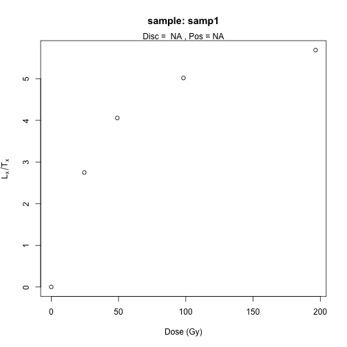

plot of chunk unnamed-chunk-10


plot of chunk unnamed-chunk-10


plot of chunk unnamed-chunk-10

Note that here we consider only one sample, and the name of the folder
is the name of the sample. For that reason the argumetns were set to
`FolderNames = samp1` and `SampleNames = samp1`.

#### Generate data file from BIN/BINX-files of multi-grain OSL measurements

For a multi-grain OSL measurements, instead of
[`Generate_DataFile()`](https://crp2a.github.io/BayLum/dev/reference/Generate_DataFile-deprecated.md),
the function
[`Generate_DataFile_MG()`](https://crp2a.github.io/BayLum/dev/reference/Generate_DataFile_MG-deprecated.md)
should be used with similar parameters. The functions differ by their
expectations: *Disc.csv* instead of *DiscPos.csv* file for Single-grain
OSL Measurements. Please check type
[`?Generate_DataFile_MG`](https://crp2a.github.io/BayLum/dev/reference/Generate_DataFile_MG-deprecated.md)
for further information.

### Option 2: Import data using `create_DataFile()`

With `'BayLum'` \>= v0.3.2 we introduced a new function called
[`create_DataFile()`](https://crp2a.github.io/BayLum/dev/reference/create_DataFile.md),
which will at some point in time replace the function
[`Generate_DataFile()`](https://crp2a.github.io/BayLum/dev/reference/Generate_DataFile-deprecated.md)
and
[`Generate_DataFile_MG()`](https://crp2a.github.io/BayLum/dev/reference/Generate_DataFile_MG-deprecated.md).
[`create_DataFile()`](https://crp2a.github.io/BayLum/dev/reference/create_DataFile.md)
works conceptionally very different from the approach detailed above.
Key differences are:

- The function uses a single configuration file for all samples and all
  measurement files
- The very error prone subfolder structure is no longer needed
- Measurement data can be imported with
  [`create_DataFile()`](https://crp2a.github.io/BayLum/dev/reference/create_DataFile.md),
  but also outside of the function and then passed on the functions.
  This enables the possibility of extensive pre-processing and selection
  of measurement data.

The configuration follows the so-called [YAML format](https://yaml.org)
specification. For single sample the file looks as follows:

    - sample: "samp1"
    files: null
    settings:
    dose_source: { value: 0.1535, error: 0.00005891 }
    dose_env: { value: 2.512, error: 0.05626 }
    rules:
    beginSignal: 6
    endSignal: 8
    beginBackground: 50
    endBackground: 55
    beginTest: 6
    endTest: 8
    beginTestBackground: 50
    endTestBackground: 55
    inflatePercent: 0.027
    nbOfLastCycleToRemove: 1

In the case above, the configuration file assumes that data for `samp1`
are already imported and treated and a R object called `samp1` is
available in the global environment. The following example code
reproduces this case:

``` r
## get example file path from package
yaml_file <- system.file("extdata/example.yml", package = "BayLum")
samp1_file <- system.file("extdata/samp1/bin.bin", package = "BayLum")

## read YAML manually and select only the first record
config_file <- yaml::read_yaml(yaml_file)[[1]]

## import BIN/BINX files and select position 2 and grain 32 only
samp1 <- Luminescence::read_BIN2R(samp1_file, verbose = FALSE) |>
  subset(POSITION == 2 & GRAIN == 32)

## create the data file
DATA1 <- create_DataFile(config_file, verbose = FALSE)
```

    Error:
    ! [create_DataFile()] <samp1> is not a valid object in the working environment!

### Age computation

To compute the age of the sample *samp1*, you can run the following
code:

``` r
Age <- Age_Computation(
  DATA = DATA1,
  SampleName = "samp1",
  PriorAge = c(10, 100),
  distribution = "cauchy",
  LIN_fit = TRUE,
  Origin_fit = FALSE,
  Iter = 10000
)
```

    Compiling model graph
       Resolving undeclared variables
       Allocating nodes
    Graph information:
       Observed stochastic nodes: 505
       Unobserved stochastic nodes: 609
       Total graph size: 7225

    Initializing model


      |                                                        
      |                                                  |   0%
      |                                                        
      |+                                                 |   2%
      |                                                        
      |++                                                |   4%
      |                                                        
      |+++                                               |   6%
      |                                                        
      |++++                                              |   8%
      |                                                        
      |+++++                                             |  10%
      |                                                        
      |++++++                                            |  12%
      |                                                        
      |+++++++                                           |  14%
      |                                                        
      |++++++++                                          |  16%
      |                                                        
      |+++++++++                                         |  18%
      |                                                        
      |++++++++++                                        |  20%
      |                                                        
      |+++++++++++                                       |  22%
      |                                                        
      |++++++++++++                                      |  24%
      |                                                        
      |+++++++++++++                                     |  26%
      |                                                        
      |++++++++++++++                                    |  28%
      |                                                        
      |+++++++++++++++                                   |  30%
      |                                                        
      |++++++++++++++++                                  |  32%
      |                                                        
      |+++++++++++++++++                                 |  34%
      |                                                        
      |++++++++++++++++++                                |  36%
      |                                                        
      |+++++++++++++++++++                               |  38%
      |                                                        
      |++++++++++++++++++++                              |  40%
      |                                                        
      |+++++++++++++++++++++                             |  42%
      |                                                        
      |++++++++++++++++++++++                            |  44%
      |                                                        
      |+++++++++++++++++++++++                           |  46%
      |                                                        
      |++++++++++++++++++++++++                          |  48%
      |                                                        
      |+++++++++++++++++++++++++                         |  50%
      |                                                        
      |++++++++++++++++++++++++++                        |  52%
      |                                                        
      |+++++++++++++++++++++++++++                       |  54%
      |                                                        
      |++++++++++++++++++++++++++++                      |  56%
      |                                                        
      |+++++++++++++++++++++++++++++                     |  58%
      |                                                        
      |++++++++++++++++++++++++++++++                    |  60%
      |                                                        
      |+++++++++++++++++++++++++++++++                   |  62%
      |                                                        
      |++++++++++++++++++++++++++++++++                  |  64%
      |                                                        
      |+++++++++++++++++++++++++++++++++                 |  66%
      |                                                        
      |++++++++++++++++++++++++++++++++++                |  68%
      |                                                        
      |+++++++++++++++++++++++++++++++++++               |  70%
      |                                                        
      |++++++++++++++++++++++++++++++++++++              |  72%
      |                                                        
      |+++++++++++++++++++++++++++++++++++++             |  74%
      |                                                        
      |++++++++++++++++++++++++++++++++++++++            |  76%
      |                                                        
      |+++++++++++++++++++++++++++++++++++++++           |  78%
      |                                                        
      |++++++++++++++++++++++++++++++++++++++++          |  80%
      |                                                        
      |+++++++++++++++++++++++++++++++++++++++++         |  82%
      |                                                        
      |++++++++++++++++++++++++++++++++++++++++++        |  84%
      |                                                        
      |+++++++++++++++++++++++++++++++++++++++++++       |  86%
      |                                                        
      |++++++++++++++++++++++++++++++++++++++++++++      |  88%
      |                                                        
      |+++++++++++++++++++++++++++++++++++++++++++++     |  90%
      |                                                        
      |++++++++++++++++++++++++++++++++++++++++++++++    |  92%
      |                                                        
      |+++++++++++++++++++++++++++++++++++++++++++++++   |  94%
      |                                                        
      |++++++++++++++++++++++++++++++++++++++++++++++++  |  96%
      |                                                        
      |+++++++++++++++++++++++++++++++++++++++++++++++++ |  98%
      |                                                        
      |++++++++++++++++++++++++++++++++++++++++++++++++++| 100%

      |                                                        
      |                                                  |   0%
      |                                                        
      |*                                                 |   2%
      |                                                        
      |**                                                |   4%
      |                                                        
      |***                                               |   6%
      |                                                        
      |****                                              |   8%
      |                                                        
      |*****                                             |  10%
      |                                                        
      |******                                            |  12%
      |                                                        
      |*******                                           |  14%
      |                                                        
      |********                                          |  16%
      |                                                        
      |*********                                         |  18%
      |                                                        
      |**********                                        |  20%
      |                                                        
      |***********                                       |  22%
      |                                                        
      |************                                      |  24%
      |                                                        
      |*************                                     |  26%
      |                                                        
      |**************                                    |  28%
      |                                                        
      |***************                                   |  30%
      |                                                        
      |****************                                  |  32%
      |                                                        
      |*****************                                 |  34%
      |                                                        
      |******************                                |  36%
      |                                                        
      |*******************                               |  38%
      |                                                        
      |********************                              |  40%
      |                                                        
      |*********************                             |  42%
      |                                                        
      |**********************                            |  44%
      |                                                        
      |***********************                           |  46%
      |                                                        
      |************************                          |  48%
      |                                                        
      |*************************                         |  50%
      |                                                        
      |**************************                        |  52%
      |                                                        
      |***************************                       |  54%
      |                                                        
      |****************************                      |  56%
      |                                                        
      |*****************************                     |  58%
      |                                                        
      |******************************                    |  60%
      |                                                        
      |*******************************                   |  62%
      |                                                        
      |********************************                  |  64%
      |                                                        
      |*********************************                 |  66%
      |                                                        
      |**********************************                |  68%
      |                                                        
      |***********************************               |  70%
      |                                                        
      |************************************              |  72%
      |                                                        
      |*************************************             |  74%
      |                                                        
      |**************************************            |  76%
      |                                                        
      |***************************************           |  78%
      |                                                        
      |****************************************          |  80%
      |                                                        
      |*****************************************         |  82%
      |                                                        
      |******************************************        |  84%
      |                                                        
      |*******************************************       |  86%
      |                                                        
      |********************************************      |  88%
      |                                                        
      |*********************************************     |  90%
      |                                                        
      |**********************************************    |  92%
      |                                                        
      |***********************************************   |  94%
      |                                                        
      |************************************************  |  96%
      |                                                        
      |************************************************* |  98%
      |                                                        
      |**************************************************| 100%

      |                                                        
      |                                                  |   0%
      |                                                        
      |*                                                 |   2%
      |                                                        
      |**                                                |   4%
      |                                                        
      |***                                               |   6%
      |                                                        
      |****                                              |   8%
      |                                                        
      |*****                                             |  10%
      |                                                        
      |******                                            |  12%
      |                                                        
      |*******                                           |  14%
      |                                                        
      |********                                          |  16%
      |                                                        
      |*********                                         |  18%
      |                                                        
      |**********                                        |  20%
      |                                                        
      |***********                                       |  22%
      |                                                        
      |************                                      |  24%
      |                                                        
      |*************                                     |  26%
      |                                                        
      |**************                                    |  28%
      |                                                        
      |***************                                   |  30%
      |                                                        
      |****************                                  |  32%
      |                                                        
      |*****************                                 |  34%
      |                                                        
      |******************                                |  36%
      |                                                        
      |*******************                               |  38%
      |                                                        
      |********************                              |  40%
      |                                                        
      |*********************                             |  42%
      |                                                        
      |**********************                            |  44%
      |                                                        
      |***********************                           |  46%
      |                                                        
      |************************                          |  48%
      |                                                        
      |*************************                         |  50%
      |                                                        
      |**************************                        |  52%
      |                                                        
      |***************************                       |  54%
      |                                                        
      |****************************                      |  56%
      |                                                        
      |*****************************                     |  58%
      |                                                        
      |******************************                    |  60%
      |                                                        
      |*******************************                   |  62%
      |                                                        
      |********************************                  |  64%
      |                                                        
      |*********************************                 |  66%
      |                                                        
      |**********************************                |  68%
      |                                                        
      |***********************************               |  70%
      |                                                        
      |************************************              |  72%
      |                                                        
      |*************************************             |  74%
      |                                                        
      |**************************************            |  76%
      |                                                        
      |***************************************           |  78%
      |                                                        
      |****************************************          |  80%
      |                                                        
      |*****************************************         |  82%
      |                                                        
      |******************************************        |  84%
      |                                                        
      |*******************************************       |  86%
      |                                                        
      |********************************************      |  88%
      |                                                        
      |*********************************************     |  90%
      |                                                        
      |**********************************************    |  92%
      |                                                        
      |***********************************************   |  94%
      |                                                        
      |************************************************  |  96%
      |                                                        
      |************************************************* |  98%
      |                                                        
      |**************************************************| 100%

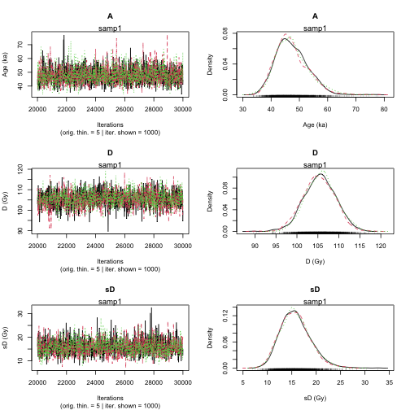

plot of chunk unnamed-chunk-12


    >> Sample name <<
    ----------------------------------------------
    samp1

    >> Results of the Gelman and Rubin criterion of convergence <<
    ----------------------------------------------
         Point estimate Uppers confidence interval
    A    1.001       1.003 
    D    1.007       1.026 
    sD   1.001       1.005 


    ---------------------------------------------------------------------------------------------------
     *** WARNING: The following information are only valid if the MCMC chains have converged  ***
    ---------------------------------------------------------------------------------------------------

    parameter    Bayes estimate       Credible interval 
    ----------------------------------------------
    A        47.284 
                             lower bound     upper bound
                     at level 95%    37.94       58.577 
                     at level 68%    40.3        50.755 
    ----------------------------------------------
    D        105.531 
                             lower bound     upper bound
                     at level 95%    97.508          112.485 
                     at level 68%    101.525         108.943 
    ----------------------------------------------
    sD       15.749 
                             lower bound     upper bound
                     at level 95%    10.059          21.741 
                     at level 68%    12.234          18.209 

This also works if `DATA1` is the output of
[`Generate_DataFile_MG()`](https://crp2a.github.io/BayLum/dev/reference/Generate_DataFile_MG-deprecated.md).

###### Remark 1: MCMC trajectories

- If MCMC trajectories did not converge, you can add more iteration with
  the parameter `Iter` in the function
  [`Age_Computation()`](https://crp2a.github.io/BayLum/dev/reference/Age_Computation.md),
  for example `Iter = 20000` or `Iter = 50000`. If it is not desirable
  to re-run the model from scratch, read the
- To increase the precision of prior distribution, if not specified
  before you can use the argument `PriorAge`. For example:
  `PriorAge= c(0.01,10)` for a young sample and `PriorAge = c(10,100)`
  for an old sample.
- If the trajectories are still not convergering, you should whether the
  choice you made with the argument `distribution` and dose-response
  curves are meaningful.

###### Remark 2: `LIN_fit` and `Origin_fit`, dose-response curves option

- By default, a saturating exponential plus linear dose response curve
  is expected. However, you choose other formula by changing arguments
  `LIN_fit` and `Origin_fit` in the function.

###### Remark 3: `distribution`, equivalent dose dispersion option

By default, a *cauchy* distribution is assumed, but you can choose
another distribution by replacing the word `cauchy` by `gaussian`,
`lognormal_A` or `lognormal_M` for the argument `distribution`.

The difference between the models: *lognormal_A* and *lognormal_M* is
that the equivalent dose dispersion are distributed according to:

- a log-normal distribution with mean or average equal to the palaeodose
  for the first model
- a log-normal distribution with median equal to the palaeodose for the
  second model.

###### Remark 4: `SavePdf` and `SaveEstimates` option

These two arguments allow to save the results to files.

- `SavePdf = TRUE` create a PDF-file with MCMC trajectories of
  parameters `A` (age), `D` (palaeodose), `sD` (equivalent doses
  dispersion). You have to specify `OutputFileName` and `OutputFilePath`
  to define name and path of the PDF-file.
- `SaveEstimates = TRUE` saves a CSV-file containing the Bayes
  estimates, the credible interval at 68% and 95% and the Gelman and
  Rudin test of convergence of the parameters `A`, `D`, `sD`. For the
  export the arguments `OutputTableName` and `OutputTablePath` have to
  be specified.

###### Remark 4: `PriorAge` option

By default, an age between 0.01 ka and 100 ka is expected. If the user
has more informations on the sample, `PriorAge` should be modified
accordingly.

For example, if you know that the sample is an older, you can set
`PriorAge=c(10,120)`. In contrast, if you know that the sample is
younger, you may want to set `PriorAge=c(0.001,10)`. Ages of $< = 0$ are
not possible. The minimum bound is 0.001.

**Please note that the setting of `PriorAge` is not trivial, wrongly set
boundaries are likely biasing your results.**

### Multiple BIN/BINX-files for one sample

In the previous example we considered only the simplest case: one
sample, and one BIN/BINX-file. However, ‘BayLum’ allows to process
multiple BIN/BINX-files for one sample. To work with multiple
BIN/BINX-files, the names of the subfolders need to beset in argument
`Names` and both files need to be located unter the same `Path`.

For the case

``` r
Names <- c("samp1", "samp2")
```

the call
[`Generate_DataFile()`](https://crp2a.github.io/BayLum/dev/reference/Generate_DataFile-deprecated.md)
(or
[`Generate_DataFile_MG()`](https://crp2a.github.io/BayLum/dev/reference/Generate_DataFile_MG-deprecated.md))
becomes as follows:

``` r
##argument setting
nbsample <- 1
nbbinfile <- length(Names)
Binpersample <- c(length(Names))

##call data file generator
DATA_BF <- Generate_DataFile(
  Path = path,
  FolderNames = Names,
  Nb_sample = nbsample,
  Nb_binfile = nbbinfile,
  BinPerSample = Binpersample,
  verbose = FALSE
)
```

    Warning in Generate_DataFile(Path = path, FolderNames = Names, Nb_sample = nbsample, : 'Generate_DataFile' is deprecated.
    Use 'create_DataFile()' instead.
    See help("Deprecated")

    Error in `Luminescence::read_BIN2R(file = paste0(Path, FolderNames[bf]), duplicated.rm = read_BIN2R.settings$duplicated.rm,
      verbose = read_BIN2R.settings$verbose)[[1]]`:
    ! this S4 class is not subsettable

``` r
##calculate the age
Age <- Age_Computation(
  DATA = DATA_BF,
  SampleName = Names,
  BinPerSample = Binpersample
)
```

    Error:
    ! object 'DATA_BF' not found

## Age analysis of various samples

### Generate data file from BIN/BINX-files

The function
[`Generate_DataFile()`](https://crp2a.github.io/BayLum/dev/reference/Generate_DataFile-deprecated.md)
(or `Generate_DataFile_MF()`) can process multiple files simultaneously
including multiple BIN/BINX-files per sample.

We assume that we are interested in two samples named: *sample1* and
*sample2*. In addition, we have two BIN/BINX-files for the first sample
named: *sample1-1* and *sample1-2*, and one BIN-file for the 2nd sample
named *sample2-1*. In such case, we need three subfolders named
*sample1-1*, *sample1-2* and *sample2-1*; which each subfolder
containing only one BIN-file named **bin.bin**, and its associated files
**DiscPos.csv**, **DoseEnv.csv**, **DoseSourve.csv** and **rule.csv**.
All of these 3 subfolders must be located in *path*.

To fill the argument corectly `BinPerSample`:
$binpersample = c\left( \underset{\text{sample 1: 2 bin files}}{\underbrace{2}},\underset{\text{sample 2: 1 bin file}}{\underbrace{1}} \right)$

``` r
Names <-
  c("sample1-1", "sample1-2", "sample2-1") # give the name of the folder datat
nbsample <- 2    # give the number of samples
nbbinfile <- 3   # give the number of bin files
DATA <- Generate_DataFile(
  Path = path,
  FolderNames = Names,
  Nb_sample = nbsample,
  Nb_binfile = nbbinfile,
  BinPerSample = binpersample
)
```

#### Combine files using the function `combine_DataFiles()`

If the user has already saved informations imported with
[`Generate_DataFile()`](https://crp2a.github.io/BayLum/dev/reference/Generate_DataFile-deprecated.md)
function (or
[`Generate_DataFile_MG()`](https://crp2a.github.io/BayLum/dev/reference/Generate_DataFile_MG-deprecated.md)
function) these data can be concatenate with the function
[`combine_DataFiles()`](https://crp2a.github.io/BayLum/dev/reference/combine_DataFiles.md).

For example, if `DATA1` is the output of sample named “GDB3”, and
`DATA2` is the output of sample “GDB5”, both data can be merged with the
following call:

``` r
data("DATA1", envir = environment())
data("DATA2", envir = environment())
DATA3 <- combine_DataFiles(L1 = DATA2, L2 = DATA1)
str(DATA3)
```

    List of 11
     $ LT            :List of 2
      ..$ : num [1:188, 1:6] 4.54 2.73 2.54 2.27 1.48 ...
      ..$ : num [1:101, 1:6] 5.66 6.9 4.05 3.43 4.97 ...
     $ sLT           :List of 2
      ..$ : num [1:188, 1:6] 0.333 0.386 0.128 0.171 0.145 ...
      ..$ : num [1:101, 1:6] 0.373 0.315 0.245 0.181 0.246 ...
     $ ITimes        :List of 2
      ..$ : num [1:188, 1:5] 40 40 40 40 40 40 40 40 40 40 ...
      ..$ : num [1:101, 1:5] 160 160 160 160 160 160 160 160 160 160 ...
     $ dLab          : num [1:2, 1:2] 1.53e-01 5.89e-05 1.53e-01 5.89e-05
     $ ddot_env      : num [1:2, 1:2] 2.512 0.0563 2.26 0.0617
     $ regDose       :List of 2
      ..$ : num [1:188, 1:5] 6.14 6.14 6.14 6.14 6.14 6.14 6.14 6.14 6.14 6.14 ...
      ..$ : num [1:101, 1:5] 24.6 24.6 24.6 24.6 24.6 ...
     $ J             : num [1:2] 188 101
     $ K             : num [1:2] 5 5
     $ Nb_measurement: num [1:2] 14 14
     $ SampleNames   : chr [1:2] "samp 1" "samp 1"
     $ Nb_sample     : num 2
     - attr(*, "originator")= chr "create_DataFile"

The data structure should become as follows

- 2 `list`s (1 `list` per sample) for `DATA$LT`, `DATA$sLT`,
  `DATA1$ITimes` and `DATA1$regDose`
- A `matrix` with 2 columns (1 line per sample) for `DATA1$dLab`,
  `DATA1$ddot_env`
- 2 `integer`s (1 `integer` per BIN files here we have 1 BIN-file per
  sample) for `DATA1$J`, `DATA1$K`, `DATA1$Nb_measurement`.

Single-grain and multiple-grain OSL measurements can be merged in the
same way. To plot the $L/T$ as a function of the regenerative dose the
function
[`LT_RegenDose()`](https://crp2a.github.io/BayLum/dev/reference/LT_RegenDose-deprecated.md)
can be used again:

``` r
plot_RegDosePoints(DATA3)
```

*Note: In the example `DATA3` contains information from the samples
‘GDB3’ and ‘GDB5’, which are single-grain OSL measurements. For a
correct treatment the argument `SG` has to be manually set by the user.
Please see the function manual for further details.*

### Age analysis without stratigraphic constraints

If no stratigraphic constraints were set, the following code can be used
to analyse the age of the sample *GDB5* and *GDB3* simultaneously.

``` r
priorage = c(1, 10, 10, 100)
Age <- AgeS_Computation(
  DATA = DATA3,
  Nb_sample = 2,
  SampleNames = c("GDB5", "GDB3"),
  PriorAge = priorage,
  distribution = "cauchy",
  LIN_fit = TRUE,
  Origin_fit = FALSE,
  Iter = 1000,
  jags_method = "rjags"
)
```

    Warning: No initial values were provided - JAGS will use the same initial values for all chains

    Compiling rjags model...
    Calling the simulation using the rjags method...
    Adapting the model for 1000 iterations...

      |                                                        
      |                                                  |   0%
      |                                                        
      |+                                                 |   2%
      |                                                        
      |++                                                |   4%
      |                                                        
      |+++                                               |   6%
      |                                                        
      |++++                                              |   8%
      |                                                        
      |+++++                                             |  10%
      |                                                        
      |++++++                                            |  12%
      |                                                        
      |+++++++                                           |  14%
      |                                                        
      |++++++++                                          |  16%
      |                                                        
      |+++++++++                                         |  18%
      |                                                        
      |++++++++++                                        |  20%
      |                                                        
      |+++++++++++                                       |  22%
      |                                                        
      |++++++++++++                                      |  24%
      |                                                        
      |+++++++++++++                                     |  26%
      |                                                        
      |++++++++++++++                                    |  28%
      |                                                        
      |+++++++++++++++                                   |  30%
      |                                                        
      |++++++++++++++++                                  |  32%
      |                                                        
      |+++++++++++++++++                                 |  34%
      |                                                        
      |++++++++++++++++++                                |  36%
      |                                                        
      |+++++++++++++++++++                               |  38%
      |                                                        
      |++++++++++++++++++++                              |  40%
      |                                                        
      |+++++++++++++++++++++                             |  42%
      |                                                        
      |++++++++++++++++++++++                            |  44%
      |                                                        
      |+++++++++++++++++++++++                           |  46%
      |                                                        
      |++++++++++++++++++++++++                          |  48%
      |                                                        
      |+++++++++++++++++++++++++                         |  50%
      |                                                        
      |++++++++++++++++++++++++++                        |  52%
      |                                                        
      |+++++++++++++++++++++++++++                       |  54%
      |                                                        
      |++++++++++++++++++++++++++++                      |  56%
      |                                                        
      |+++++++++++++++++++++++++++++                     |  58%
      |                                                        
      |++++++++++++++++++++++++++++++                    |  60%
      |                                                        
      |+++++++++++++++++++++++++++++++                   |  62%
      |                                                        
      |++++++++++++++++++++++++++++++++                  |  64%
      |                                                        
      |+++++++++++++++++++++++++++++++++                 |  66%
      |                                                        
      |++++++++++++++++++++++++++++++++++                |  68%
      |                                                        
      |+++++++++++++++++++++++++++++++++++               |  70%
      |                                                        
      |++++++++++++++++++++++++++++++++++++              |  72%
      |                                                        
      |+++++++++++++++++++++++++++++++++++++             |  74%
      |                                                        
      |++++++++++++++++++++++++++++++++++++++            |  76%
      |                                                        
      |+++++++++++++++++++++++++++++++++++++++           |  78%
      |                                                        
      |++++++++++++++++++++++++++++++++++++++++          |  80%
      |                                                        
      |+++++++++++++++++++++++++++++++++++++++++         |  82%
      |                                                        
      |++++++++++++++++++++++++++++++++++++++++++        |  84%
      |                                                        
      |+++++++++++++++++++++++++++++++++++++++++++       |  86%
      |                                                        
      |++++++++++++++++++++++++++++++++++++++++++++      |  88%
      |                                                        
      |+++++++++++++++++++++++++++++++++++++++++++++     |  90%
      |                                                        
      |++++++++++++++++++++++++++++++++++++++++++++++    |  92%
      |                                                        
      |+++++++++++++++++++++++++++++++++++++++++++++++   |  94%
      |                                                        
      |++++++++++++++++++++++++++++++++++++++++++++++++  |  96%
      |                                                        
      |+++++++++++++++++++++++++++++++++++++++++++++++++ |  98%
      |                                                        
      |++++++++++++++++++++++++++++++++++++++++++++++++++| 100%
    Burning in the model for 4000 iterations...

      |                                                        
      |                                                  |   0%
      |                                                        
      |*                                                 |   2%
      |                                                        
      |**                                                |   4%
      |                                                        
      |***                                               |   6%
      |                                                        
      |****                                              |   8%
      |                                                        
      |*****                                             |  10%
      |                                                        
      |******                                            |  12%
      |                                                        
      |*******                                           |  14%
      |                                                        
      |********                                          |  16%
      |                                                        
      |*********                                         |  18%
      |                                                        
      |**********                                        |  20%
      |                                                        
      |***********                                       |  22%
      |                                                        
      |************                                      |  24%
      |                                                        
      |*************                                     |  26%
      |                                                        
      |**************                                    |  28%
      |                                                        
      |***************                                   |  30%
      |                                                        
      |****************                                  |  32%
      |                                                        
      |*****************                                 |  34%
      |                                                        
      |******************                                |  36%
      |                                                        
      |*******************                               |  38%
      |                                                        
      |********************                              |  40%
      |                                                        
      |*********************                             |  42%
      |                                                        
      |**********************                            |  44%
      |                                                        
      |***********************                           |  46%
      |                                                        
      |************************                          |  48%
      |                                                        
      |*************************                         |  50%
      |                                                        
      |**************************                        |  52%
      |                                                        
      |***************************                       |  54%
      |                                                        
      |****************************                      |  56%
      |                                                        
      |*****************************                     |  58%
      |                                                        
      |******************************                    |  60%
      |                                                        
      |*******************************                   |  62%
      |                                                        
      |********************************                  |  64%
      |                                                        
      |*********************************                 |  66%
      |                                                        
      |**********************************                |  68%
      |                                                        
      |***********************************               |  70%
      |                                                        
      |************************************              |  72%
      |                                                        
      |*************************************             |  74%
      |                                                        
      |**************************************            |  76%
      |                                                        
      |***************************************           |  78%
      |                                                        
      |****************************************          |  80%
      |                                                        
      |*****************************************         |  82%
      |                                                        
      |******************************************        |  84%
      |                                                        
      |*******************************************       |  86%
      |                                                        
      |********************************************      |  88%
      |                                                        
      |*********************************************     |  90%
      |                                                        
      |**********************************************    |  92%
      |                                                        
      |***********************************************   |  94%
      |                                                        
      |************************************************  |  96%
      |                                                        
      |************************************************* |  98%
      |                                                        
      |**************************************************| 100%
    Running the model for 5000 iterations...

      |                                                        
      |                                                  |   0%
      |                                                        
      |*                                                 |   2%
      |                                                        
      |**                                                |   3%
      |                                                        
      |**                                                |   5%
      |                                                        
      |***                                               |   6%
      |                                                        
      |****                                              |   8%
      |                                                        
      |*****                                             |  10%
      |                                                        
      |******                                            |  11%
      |                                                        
      |******                                            |  13%
      |                                                        
      |*******                                           |  14%
      |                                                        
      |********                                          |  16%
      |                                                        
      |*********                                         |  18%
      |                                                        
      |**********                                        |  19%
      |                                                        
      |**********                                        |  21%
      |                                                        
      |***********                                       |  22%
      |                                                        
      |************                                      |  24%
      |                                                        
      |*************                                     |  26%
      |                                                        
      |**************                                    |  27%
      |                                                        
      |**************                                    |  29%
      |                                                        
      |***************                                   |  30%
      |                                                        
      |****************                                  |  32%
      |                                                        
      |*****************                                 |  34%
      |                                                        
      |******************                                |  35%
      |                                                        
      |******************                                |  37%
      |                                                        
      |*******************                               |  38%
      |                                                        
      |********************                              |  40%
      |                                                        
      |*********************                             |  42%
      |                                                        
      |**********************                            |  43%
      |                                                        
      |**********************                            |  45%
      |                                                        
      |***********************                           |  46%
      |                                                        
      |************************                          |  48%
      |                                                        
      |*************************                         |  50%
      |                                                        
      |**************************                        |  51%
      |                                                        
      |**************************                        |  53%
      |                                                        
      |***************************                       |  54%
      |                                                        
      |****************************                      |  56%
      |                                                        
      |*****************************                     |  58%
      |                                                        
      |******************************                    |  59%
      |                                                        
      |******************************                    |  61%
      |                                                        
      |*******************************                   |  62%
      |                                                        
      |********************************                  |  64%
      |                                                        
      |*********************************                 |  66%
      |                                                        
      |**********************************                |  67%
      |                                                        
      |**********************************                |  69%
      |                                                        
      |***********************************               |  70%
      |                                                        
      |************************************              |  72%
      |                                                        
      |*************************************             |  74%
      |                                                        
      |**************************************            |  75%
      |                                                        
      |**************************************            |  77%
      |                                                        
      |***************************************           |  78%
      |                                                        
      |****************************************          |  80%
      |                                                        
      |*****************************************         |  82%
      |                                                        
      |******************************************        |  83%
      |                                                        
      |******************************************        |  85%
      |                                                        
      |*******************************************       |  86%
      |                                                        
      |********************************************      |  88%
      |                                                        
      |*********************************************     |  90%
      |                                                        
      |**********************************************    |  91%
      |                                                        
      |**********************************************    |  93%
      |                                                        
      |***********************************************   |  94%
      |                                                        
      |************************************************  |  96%
      |                                                        
      |************************************************* |  98%
      |                                                        
      |**************************************************|  99%
      |                                                        
      |**************************************************| 100%
    Simulation complete
    Calculating summary statistics...
    Calculating the Gelman-Rubin statistic for 6 variables....
    Finished running the simulation

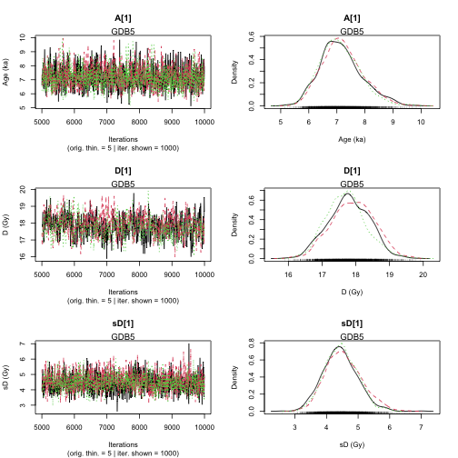

plot of chunk unnamed-chunk-18

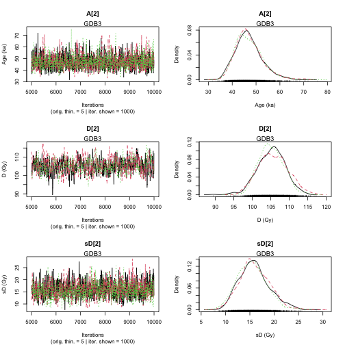

plot of chunk unnamed-chunk-18


    >> Results of the Gelman and Rubin criterion of convergence <<
    ----------------------------------------------
     Sample name:  GDB5 
    ---------------------
             Point estimate Uppers confidence interval
    A_GDB5   1.003       1.01 
    D_GDB5   1.02        1.07 
    sD_GDB5      1.011       1.035 
    ----------------------------------------------
     Sample name:  GDB3 
    ---------------------
             Point estimate Uppers confidence interval
    A_GDB3   1       1.001 
    D_GDB3   1.01        1.025 
    sD_GDB3      1.008       1.031 


    ---------------------------------------------------------------------------------------------------
     *** WARNING: The following information are only valid if the MCMC chains have converged  ***
    ---------------------------------------------------------------------------------------------------


    >> Bayes estimates of Age, Palaeodose and its dispersion for each sample and credible interval <<
    ----------------------------------------------
     Sample name:  GDB5 
    ---------------------
    Parameter    Bayes estimate       Credible interval 
     A_GDB5      7.157 
                             lower bound     upper bound
                     at level 95%    5.781       8.583 
                     at level 68%    6.32        7.701 

    Parameter    Bayes estimate       Credible interval 
     D_GDB5      17.809 
                             lower bound     upper bound
                     at level 95%    16.616          18.966 
                     at level 68%    17.219          18.462 

    Parameter    Bayes estimate       Credible interval 
    sD_GDB5      4.481 
                             lower bound     upper bound
                     at level 95%    3.312       5.388 
                     at level 68%    3.864       4.924 
    ----------------------------------------------
     Sample name:  GDB3 
    ---------------------
    Parameter    Bayes estimate       Credible interval 
     A_GDB3      47.021 
                             lower bound     upper bound
                     at level 95%    37.065          58.284 
                     at level 68%    40.89       51.208 

    Parameter    Bayes estimate       Credible interval 
     D_GDB3      105.311 
                             lower bound     upper bound
                     at level 95%    98.048          112.251 
                     at level 68%    101.317         108.586 

    Parameter    Bayes estimate       Credible interval 
    sD_GDB3      15.775 
                             lower bound     upper bound
                     at level 95%    10.559          22.546 
                     at level 68%    11.962          17.945 

    ----------------------------------------------

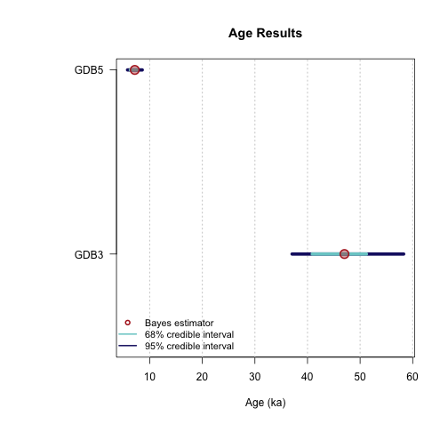

plot of chunk unnamed-chunk-18

**Note:** For an automated parallel processing you can set the argument
`jags_method = "rjags"` to `jags_method = "rjparallel"`.

#### Remarks

As for the function `Age_computation()`, the age for each sample is set
by default between 0.01 ka and 100 ka. If you have more informations on
your samples it is possible to change `PriorAge` parameters. `PriorAge`
is a vector of `size = 2*$Nb_sample`, the two first values of `PriorAge`
concern the 1st sample, the next two values the 2nd sample and so on.

For example, if you know that sample named *GDB5* is a young sample
whose its age is between 0.01 ka and 10 ka, and *GDB3* is an old sample
whose age is between 10 ka and 100 ka,
$$PriorAge = c\left( \underset{GDB5\ prior\ age}{\underbrace{0.01,10}},\underset{GDB3\ prior\ age}{\underbrace{10,100}} \right)$$

### Age analysis with stratigraphic constraints

With the function
[`AgeS_Computation()`](https://crp2a.github.io/BayLum/dev/reference/AgeS_Computation.md)
it is possible to take the stratigraphic relations between samples into
account and define constraints.

For example, we know that *GDB5* is in a higher stratigraphical
position, hence it likely has a younger age than sample *GDB3*.

#### Ordering samples

To take into account stratigraphic constraints, the information on the
samples need to be ordered. Either you enter a sample name
(corresponding to subfolder names) in `Names` parameter of the function
[`Generate_DataFile()`](https://crp2a.github.io/BayLum/dev/reference/Generate_DataFile-deprecated.md),
ordered by order of increasing ages or you enter saved .RData
informations of each sample in
[`combine_DataFiles()`](https://crp2a.github.io/BayLum/dev/reference/combine_DataFiles.md),
ordered by increasing ages.

``` r
# using Generate_DataFile function
Names <- c("samp1", "samp2")
nbsample <- 2
DATA3 <- Generate_DataFile(
  Path = path,
  FolderNames = Names,
  Nb_sample = nbsample,
  verbose = FALSE
)
```

    Warning in Generate_DataFile(Path = path, FolderNames = Names, Nb_sample = nbsample, : 'Generate_DataFile' is deprecated.
    Use 'create_DataFile()' instead.
    See help("Deprecated")

    Error in `Luminescence::read_BIN2R(file = paste0(Path, FolderNames[bf]), duplicated.rm = read_BIN2R.settings$duplicated.rm,
      verbose = read_BIN2R.settings$verbose)[[1]]`:
    ! this S4 class is not subsettable

``` r
# using the function combine_DataFiles()
data(DATA1, envir = environment()) # .RData on sample GDB3
data(DATA2, envir = environment()) # .RData on sample GDB5
DATA3 <- combine_DataFiles(L1 = DATA1, L2 = DATA2)
```

#### Define matrix to set stratigraphic constraints

Let `SC` be the matrix containing all information on stratigraphic
relations for this two samples. This matrix is defined as follows:

- matrix dimensions: the row number of `StratiConstraints` matrix is
  equal to `Nb_sample+1`, and column number is equal to $Nb\_ sample$.

- first matrix row: for all $i$ in $\{ 1,...,Nb\_ Sample\}$,
  `StratiConstraints[1,i] <- 1`, means that the lower bound of the
  sample age given in `PriorAge[2i-1]` for the sample whose number ID is
  equal to $i$ is taken into account

- sample relations: for all $j$ in \${2,…,Nb_Sample+1}\$ and all $i$ in
  $\{ j,...,Nb\_ Sample\}$, `StratiConstraints[j,i] <- 1` if the sample
  age whose ID is equal to $j - 1$ is lower than the sample age whose ID
  is equal to $i$. Otherwise, `StratiConstraints[j,i] <- 0`.

To the define such matrix the function *SCMatrix()* can be used:

``` r
SC <- SCMatrix(Nb_sample = 2,
               SampleNames = c("samp1", "samp2"))
```

In our case: 2 samples, `SC` is a matrix with 3 rows and 2 columns. The
first row contains `c(1,1)` (because we take into account the prior
ages), the second line contains `c(0,1)` (sample 2, named *samp2* is
supposed to be older than sample 1, named *samp1*) and the third line
contains `c(0,0)` (sample 2, named *samp2* is not younger than the
sample 1, here named *samp1*). We can also fill the matrix with the
stratigraphic relations as follow:

``` r
SC <- matrix(
  data = c(1, 1, 0, 1, 0, 0),
  ncol = 2,
  nrow = (2 + 1),
  byrow = T
)
```

#### Age computation

``` r
Age <-
  AgeS_Computation(
    DATA = DATA3,
    Nb_sample = 2,
    SampleNames = c("samp1", "samp2"),
    PriorAge = priorage,
    distribution = "cauchy",
    LIN_fit = TRUE,
    Origin_fit = FALSE,
    StratiConstraints = SC,
    Iter = 1000,
    jags_method = 'rjags')
```

    Warning: No initial values were provided - JAGS will use the same initial values for all chains

    Compiling rjags model...
    Calling the simulation using the rjags method...
    Adapting the model for 1000 iterations...

      |                                                        
      |                                                  |   0%
      |                                                        
      |+                                                 |   2%
      |                                                        
      |++                                                |   4%
      |                                                        
      |+++                                               |   6%
      |                                                        
      |++++                                              |   8%
      |                                                        
      |+++++                                             |  10%
      |                                                        
      |++++++                                            |  12%
      |                                                        
      |+++++++                                           |  14%
      |                                                        
      |++++++++                                          |  16%
      |                                                        
      |+++++++++                                         |  18%
      |                                                        
      |++++++++++                                        |  20%
      |                                                        
      |+++++++++++                                       |  22%
      |                                                        
      |++++++++++++                                      |  24%
      |                                                        
      |+++++++++++++                                     |  26%
      |                                                        
      |++++++++++++++                                    |  28%
      |                                                        
      |+++++++++++++++                                   |  30%
      |                                                        
      |++++++++++++++++                                  |  32%
      |                                                        
      |+++++++++++++++++                                 |  34%
      |                                                        
      |++++++++++++++++++                                |  36%
      |                                                        
      |+++++++++++++++++++                               |  38%
      |                                                        
      |++++++++++++++++++++                              |  40%
      |                                                        
      |+++++++++++++++++++++                             |  42%
      |                                                        
      |++++++++++++++++++++++                            |  44%
      |                                                        
      |+++++++++++++++++++++++                           |  46%
      |                                                        
      |++++++++++++++++++++++++                          |  48%
      |                                                        
      |+++++++++++++++++++++++++                         |  50%
      |                                                        
      |++++++++++++++++++++++++++                        |  52%
      |                                                        
      |+++++++++++++++++++++++++++                       |  54%
      |                                                        
      |++++++++++++++++++++++++++++                      |  56%
      |                                                        
      |+++++++++++++++++++++++++++++                     |  58%
      |                                                        
      |++++++++++++++++++++++++++++++                    |  60%
      |                                                        
      |+++++++++++++++++++++++++++++++                   |  62%
      |                                                        
      |++++++++++++++++++++++++++++++++                  |  64%
      |                                                        
      |+++++++++++++++++++++++++++++++++                 |  66%
      |                                                        
      |++++++++++++++++++++++++++++++++++                |  68%
      |                                                        
      |+++++++++++++++++++++++++++++++++++               |  70%
      |                                                        
      |++++++++++++++++++++++++++++++++++++              |  72%
      |                                                        
      |+++++++++++++++++++++++++++++++++++++             |  74%
      |                                                        
      |++++++++++++++++++++++++++++++++++++++            |  76%
      |                                                        
      |+++++++++++++++++++++++++++++++++++++++           |  78%
      |                                                        
      |++++++++++++++++++++++++++++++++++++++++          |  80%
      |                                                        
      |+++++++++++++++++++++++++++++++++++++++++         |  82%
      |                                                        
      |++++++++++++++++++++++++++++++++++++++++++        |  84%
      |                                                        
      |+++++++++++++++++++++++++++++++++++++++++++       |  86%
      |                                                        
      |++++++++++++++++++++++++++++++++++++++++++++      |  88%
      |                                                        
      |+++++++++++++++++++++++++++++++++++++++++++++     |  90%
      |                                                        
      |++++++++++++++++++++++++++++++++++++++++++++++    |  92%
      |                                                        
      |+++++++++++++++++++++++++++++++++++++++++++++++   |  94%
      |                                                        
      |++++++++++++++++++++++++++++++++++++++++++++++++  |  96%
      |                                                        
      |+++++++++++++++++++++++++++++++++++++++++++++++++ |  98%
      |                                                        
      |++++++++++++++++++++++++++++++++++++++++++++++++++| 100%
    Burning in the model for 4000 iterations...

      |                                                        
      |                                                  |   0%
      |                                                        
      |*                                                 |   2%
      |                                                        
      |**                                                |   4%
      |                                                        
      |***                                               |   6%
      |                                                        
      |****                                              |   8%
      |                                                        
      |*****                                             |  10%
      |                                                        
      |******                                            |  12%
      |                                                        
      |*******                                           |  14%
      |                                                        
      |********                                          |  16%
      |                                                        
      |*********                                         |  18%
      |                                                        
      |**********                                        |  20%
      |                                                        
      |***********                                       |  22%
      |                                                        
      |************                                      |  24%
      |                                                        
      |*************                                     |  26%
      |                                                        
      |**************                                    |  28%
      |                                                        
      |***************                                   |  30%
      |                                                        
      |****************                                  |  32%
      |                                                        
      |*****************                                 |  34%
      |                                                        
      |******************                                |  36%
      |                                                        
      |*******************                               |  38%
      |                                                        
      |********************                              |  40%
      |                                                        
      |*********************                             |  42%
      |                                                        
      |**********************                            |  44%
      |                                                        
      |***********************                           |  46%
      |                                                        
      |************************                          |  48%
      |                                                        
      |*************************                         |  50%
      |                                                        
      |**************************                        |  52%
      |                                                        
      |***************************                       |  54%
      |                                                        
      |****************************                      |  56%
      |                                                        
      |*****************************                     |  58%
      |                                                        
      |******************************                    |  60%
      |                                                        
      |*******************************                   |  62%
      |                                                        
      |********************************                  |  64%
      |                                                        
      |*********************************                 |  66%
      |                                                        
      |**********************************                |  68%
      |                                                        
      |***********************************               |  70%
      |                                                        
      |************************************              |  72%
      |                                                        
      |*************************************             |  74%
      |                                                        
      |**************************************            |  76%
      |                                                        
      |***************************************           |  78%
      |                                                        
      |****************************************          |  80%
      |                                                        
      |*****************************************         |  82%
      |                                                        
      |******************************************        |  84%
      |                                                        
      |*******************************************       |  86%
      |                                                        
      |********************************************      |  88%
      |                                                        
      |*********************************************     |  90%
      |                                                        
      |**********************************************    |  92%
      |                                                        
      |***********************************************   |  94%
      |                                                        
      |************************************************  |  96%
      |                                                        
      |************************************************* |  98%
      |                                                        
      |**************************************************| 100%
    Running the model for 5000 iterations...

      |                                                        
      |                                                  |   0%
      |                                                        
      |*                                                 |   2%
      |                                                        
      |**                                                |   3%
      |                                                        
      |**                                                |   5%
      |                                                        
      |***                                               |   6%
      |                                                        
      |****                                              |   8%
      |                                                        
      |*****                                             |  10%
      |                                                        
      |******                                            |  11%
      |                                                        
      |******                                            |  13%
      |                                                        
      |*******                                           |  14%
      |                                                        
      |********                                          |  16%
      |                                                        
      |*********                                         |  18%
      |                                                        
      |**********                                        |  19%
      |                                                        
      |**********                                        |  21%
      |                                                        
      |***********                                       |  22%
      |                                                        
      |************                                      |  24%
      |                                                        
      |*************                                     |  26%
      |                                                        
      |**************                                    |  27%
      |                                                        
      |**************                                    |  29%
      |                                                        
      |***************                                   |  30%
      |                                                        
      |****************                                  |  32%
      |                                                        
      |*****************                                 |  34%
      |                                                        
      |******************                                |  35%
      |                                                        
      |******************                                |  37%
      |                                                        
      |*******************                               |  38%
      |                                                        
      |********************                              |  40%
      |                                                        
      |*********************                             |  42%
      |                                                        
      |**********************                            |  43%
      |                                                        
      |**********************                            |  45%
      |                                                        
      |***********************                           |  46%
      |                                                        
      |************************                          |  48%
      |                                                        
      |*************************                         |  50%
      |                                                        
      |**************************                        |  51%
      |                                                        
      |**************************                        |  53%
      |                                                        
      |***************************                       |  54%
      |                                                        
      |****************************                      |  56%
      |                                                        
      |*****************************                     |  58%
      |                                                        
      |******************************                    |  59%
      |                                                        
      |******************************                    |  61%
      |                                                        
      |*******************************                   |  62%
      |                                                        
      |********************************                  |  64%
      |                                                        
      |*********************************                 |  66%
      |                                                        
      |**********************************                |  67%
      |                                                        
      |**********************************                |  69%
      |                                                        
      |***********************************               |  70%
      |                                                        
      |************************************              |  72%
      |                                                        
      |*************************************             |  74%
      |                                                        
      |**************************************            |  75%
      |                                                        
      |**************************************            |  77%
      |                                                        
      |***************************************           |  78%
      |                                                        
      |****************************************          |  80%
      |                                                        
      |*****************************************         |  82%
      |                                                        
      |******************************************        |  83%
      |                                                        
      |******************************************        |  85%
      |                                                        
      |*******************************************       |  86%
      |                                                        
      |********************************************      |  88%
      |                                                        
      |*********************************************     |  90%
      |                                                        
      |**********************************************    |  91%
      |                                                        
      |**********************************************    |  93%
      |                                                        
      |***********************************************   |  94%
      |                                                        
      |************************************************  |  96%
      |                                                        
      |************************************************* |  98%
      |                                                        
      |**************************************************|  99%
      |                                                        
      |**************************************************| 100%
    Simulation complete
    Calculating summary statistics...
    Calculating the Gelman-Rubin statistic for 6 variables....
    Finished running the simulation

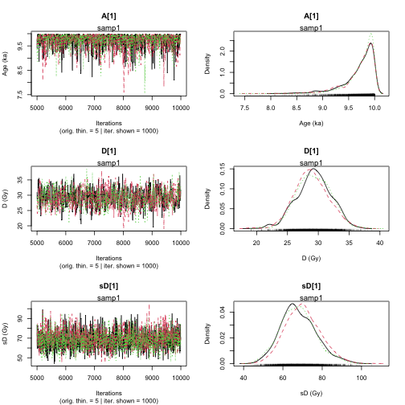

plot of chunk unnamed-chunk-23

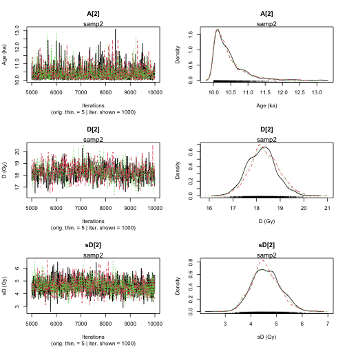

plot of chunk unnamed-chunk-23


    >> Results of the Gelman and Rubin criterion of convergence <<
    ----------------------------------------------
     Sample name:  samp1 
    ---------------------
             Point estimate Uppers confidence interval
    A_samp1      1.004       1.012 
    D_samp1      1.003       1.013 
    sD_samp1     1.015       1.054 
    ----------------------------------------------
     Sample name:  samp2 
    ---------------------
             Point estimate Uppers confidence interval
    A_samp2      1       1.001 
    D_samp2      1.007       1.025 
    sD_samp2     1.001       1.003 


    ---------------------------------------------------------------------------------------------------
     *** WARNING: The following information are only valid if the MCMC chains have converged  ***
    ---------------------------------------------------------------------------------------------------


    >> Bayes estimates of Age, Palaeodose and its dispersion for each sample and credible interval <<
    ----------------------------------------------
     Sample name:  samp1 
    ---------------------
    Parameter    Bayes estimate       Credible interval 
     A_samp1     9.716 
                             lower bound     upper bound
                     at level 95%    9.123       10 
                     at level 68%    9.686       10 

    Parameter    Bayes estimate       Credible interval 
     D_samp1     29.154 
                             lower bound     upper bound
                     at level 95%    23.916          34.449 
                     at level 68%    26.295          31.873 

    Parameter    Bayes estimate       Credible interval 
    sD_samp1     68.574 
                             lower bound     upper bound
                     at level 95%    49.706          85.214 
                     at level 68%    58.27       75.354 
    ----------------------------------------------
     Sample name:  samp2 
    ---------------------
    Parameter    Bayes estimate       Credible interval 
     A_samp2     10.409 
                             lower bound     upper bound
                     at level 95%    10          11.209 
                     at level 68%    10.001          10.465 

    Parameter    Bayes estimate       Credible interval 
     D_samp2     18.28 
                             lower bound     upper bound
                     at level 95%    16.997          19.442 
                     at level 68%    17.672          18.882 

    Parameter    Bayes estimate       Credible interval 
    sD_samp2     4.583 
                             lower bound     upper bound
                     at level 95%    3.542       5.641 
                     at level 68%    3.931       5.007 

    ----------------------------------------------


plot of chunk unnamed-chunk-23

Thee results can be also be used for an alternative graphical
representation:

``` r
plot_Ages(Age, plot_mode = "density")
```

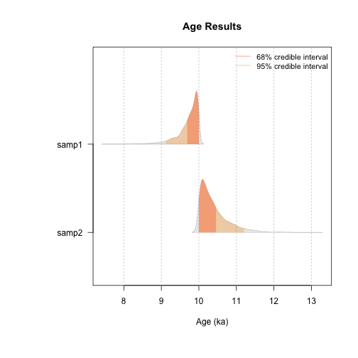

plot of chunk unnamed-chunk-24

      SAMPLE    AGE HPD68.MIN HPD68.MAX HPD95.MIN HPD95.MAX ALT_SAMPLE_NAME AT
    1  samp1  9.716     9.686    10.000     9.123    10.000              NA  2
    2  samp2 10.409    10.001    10.465    10.000    11.209              NA  1

### When MCMC trajectories did not converge

If MCMC trajectories did not converge, it means we should run additional
MCMC iterations. For `AgeS_computation()` and
[`Age_OSLC14()`](https://crp2a.github.io/BayLum/dev/reference/Age_OSLC14.md)
models we can run additional iterations by supplying the function output
back into the parent function. In the following, notice we are using the
output of the previous `AgeS_computation()` example, namely `Age`. The
key argument to set/change is `DATA`.

``` r
Age <- AgeS_Computation(
  DATA = Age,
  Nb_sample = 2,
  SampleNames = c("GDB5", "GDB3"),
  PriorAge = priorage,
  distribution = "cauchy",
  LIN_fit = TRUE,
  Origin_fit = FALSE,
  Iter = 1000,
  jags_method = "rjags"
)
```

    Calling the simulation using the rjags method...
    Note: the model did not require adaptation
    Burning in the model for 4000 iterations...

      |                                                        
      |                                                  |   0%
      |                                                        
      |*                                                 |   2%
      |                                                        
      |**                                                |   4%
      |                                                        
      |***                                               |   6%
      |                                                        
      |****                                              |   8%
      |                                                        
      |*****                                             |  10%
      |                                                        
      |******                                            |  12%
      |                                                        
      |*******                                           |  14%
      |                                                        
      |********                                          |  16%
      |                                                        
      |*********                                         |  18%
      |                                                        
      |**********                                        |  20%
      |                                                        
      |***********                                       |  22%
      |                                                        
      |************                                      |  24%
      |                                                        
      |*************                                     |  26%
      |                                                        
      |**************                                    |  28%
      |                                                        
      |***************                                   |  30%
      |                                                        
      |****************                                  |  32%
      |                                                        
      |*****************                                 |  34%
      |                                                        
      |******************                                |  36%
      |                                                        
      |*******************                               |  38%
      |                                                        
      |********************                              |  40%
      |                                                        
      |*********************                             |  42%
      |                                                        
      |**********************                            |  44%
      |                                                        
      |***********************                           |  46%
      |                                                        
      |************************                          |  48%
      |                                                        
      |*************************                         |  50%
      |                                                        
      |**************************                        |  52%
      |                                                        
      |***************************                       |  54%
      |                                                        
      |****************************                      |  56%
      |                                                        
      |*****************************                     |  58%
      |                                                        
      |******************************                    |  60%
      |                                                        
      |*******************************                   |  62%
      |                                                        
      |********************************                  |  64%
      |                                                        
      |*********************************                 |  66%
      |                                                        
      |**********************************                |  68%
      |                                                        
      |***********************************               |  70%
      |                                                        
      |************************************              |  72%
      |                                                        
      |*************************************             |  74%
      |                                                        
      |**************************************            |  76%
      |                                                        
      |***************************************           |  78%
      |                                                        
      |****************************************          |  80%
      |                                                        
      |*****************************************         |  82%
      |                                                        
      |******************************************        |  84%
      |                                                        
      |*******************************************       |  86%
      |                                                        
      |********************************************      |  88%
      |                                                        
      |*********************************************     |  90%
      |                                                        
      |**********************************************    |  92%
      |                                                        
      |***********************************************   |  94%
      |                                                        
      |************************************************  |  96%
      |                                                        
      |************************************************* |  98%
      |                                                        
      |**************************************************| 100%
    Running the model for 5000 iterations...

      |                                                        
      |                                                  |   0%
      |                                                        
      |*                                                 |   2%
      |                                                        
      |**                                                |   3%
      |                                                        
      |**                                                |   5%
      |                                                        
      |***                                               |   6%
      |                                                        
      |****                                              |   8%
      |                                                        
      |*****                                             |  10%
      |                                                        
      |******                                            |  11%
      |                                                        
      |******                                            |  13%
      |                                                        
      |*******                                           |  14%
      |                                                        
      |********                                          |  16%
      |                                                        
      |*********                                         |  18%
      |                                                        
      |**********                                        |  19%
      |                                                        
      |**********                                        |  21%
      |                                                        
      |***********                                       |  22%
      |                                                        
      |************                                      |  24%
      |                                                        
      |*************                                     |  26%
      |                                                        
      |**************                                    |  27%
      |                                                        
      |**************                                    |  29%
      |                                                        
      |***************                                   |  30%
      |                                                        
      |****************                                  |  32%
      |                                                        
      |*****************                                 |  34%
      |                                                        
      |******************                                |  35%
      |                                                        
      |******************                                |  37%
      |                                                        
      |*******************                               |  38%
      |                                                        
      |********************                              |  40%
      |                                                        
      |*********************                             |  42%
      |                                                        
      |**********************                            |  43%
      |                                                        
      |**********************                            |  45%
      |                                                        
      |***********************                           |  46%
      |                                                        
      |************************                          |  48%
      |                                                        
      |*************************                         |  50%
      |                                                        
      |**************************                        |  51%
      |                                                        
      |**************************                        |  53%
      |                                                        
      |***************************                       |  54%
      |                                                        
      |****************************                      |  56%
      |                                                        
      |*****************************                     |  58%
      |                                                        
      |******************************                    |  59%
      |                                                        
      |******************************                    |  61%
      |                                                        
      |*******************************                   |  62%
      |                                                        
      |********************************                  |  64%
      |                                                        
      |*********************************                 |  66%
      |                                                        
      |**********************************                |  67%
      |                                                        
      |**********************************                |  69%
      |                                                        
      |***********************************               |  70%
      |                                                        
      |************************************              |  72%
      |                                                        
      |*************************************             |  74%
      |                                                        
      |**************************************            |  75%
      |                                                        
      |**************************************            |  77%
      |                                                        
      |***************************************           |  78%
      |                                                        
      |****************************************          |  80%
      |                                                        
      |*****************************************         |  82%
      |                                                        
      |******************************************        |  83%
      |                                                        
      |******************************************        |  85%
      |                                                        
      |*******************************************       |  86%
      |                                                        
      |********************************************      |  88%
      |                                                        
      |*********************************************     |  90%
      |                                                        
      |**********************************************    |  91%
      |                                                        
      |**********************************************    |  93%
      |                                                        
      |***********************************************   |  94%
      |                                                        
      |************************************************  |  96%
      |                                                        
      |************************************************* |  98%
      |                                                        
      |**************************************************|  99%
      |                                                        
      |**************************************************| 100%
    Simulation complete
    Calculating summary statistics...
    Calculating the Gelman-Rubin statistic for 6 variables....
    Finished running the simulation

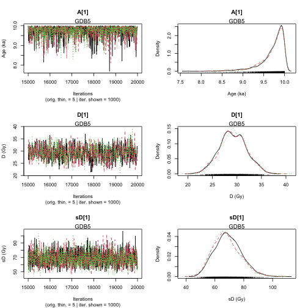

plot of chunk unnamed-chunk-25

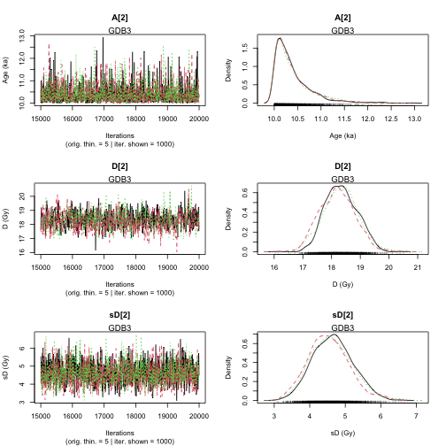

plot of chunk unnamed-chunk-25


    >> Results of the Gelman and Rubin criterion of convergence <<
    ----------------------------------------------
     Sample name:  GDB5 
    ---------------------
             Point estimate Uppers confidence interval
    A_GDB5   1.002       1.003 
    D_GDB5   1.001       1.004 
    sD_GDB5      1.004       1.014 
    ----------------------------------------------
     Sample name:  GDB3 
    ---------------------
             Point estimate Uppers confidence interval
    A_GDB3   1.001       1.002 
    D_GDB3   1.015       1.047 
    sD_GDB3      1.009       1.032 


    ---------------------------------------------------------------------------------------------------
     *** WARNING: The following information are only valid if the MCMC chains have converged  ***
    ---------------------------------------------------------------------------------------------------


    >> Bayes estimates of Age, Palaeodose and its dispersion for each sample and credible interval <<
    ----------------------------------------------
     Sample name:  GDB5 
    ---------------------
    Parameter    Bayes estimate       Credible interval 
     A_GDB5      9.717 
                             lower bound     upper bound
                     at level 95%    9.138       10 
                     at level 68%    9.681       9.999 

    Parameter    Bayes estimate       Credible interval 
     D_GDB5      29.253 
                             lower bound     upper bound
                     at level 95%    23.729          34.372 
                     at level 68%    26.627          31.959 

    Parameter    Bayes estimate       Credible interval 
    sD_GDB5      68.368 
                             lower bound     upper bound
                     at level 95%    52.186          86.396 
                     at level 68%    58.845          77.111 
    ----------------------------------------------
     Sample name:  GDB3 
    ---------------------
    Parameter    Bayes estimate       Credible interval 
     A_GDB3      10.394 
                             lower bound     upper bound
                     at level 95%    10          11.189 
                     at level 68%    10          10.438 

    Parameter    Bayes estimate       Credible interval 
     D_GDB3      18.289 
                             lower bound     upper bound
                     at level 95%    17.169          19.425 
                     at level 68%    17.617          18.797 

    Parameter    Bayes estimate       Credible interval 
    sD_GDB3      4.602 
                             lower bound     upper bound
                     at level 95%    3.596       5.727 
                     at level 68%    4.015       5.117 

    ----------------------------------------------

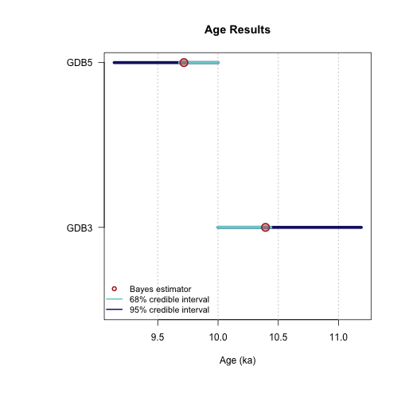

plot of chunk unnamed-chunk-25

## References

Combès, B., Philippe, A., Lanos, P., Mercier, N., Tribolo, C., Guerin,
G., Guibert, P., Lahaye, C., 2015. A Bayesian central equivalent dose
model for optically stimulated luminescence dating. Quaternary
Geochronology 28, 62-70. doi:
[10.1016/j.quageo.2015.04.001](https://doi.org/10.1016/j.quageo.2015.04.001)

Combès, B., Philippe, A., 2017. Bayesian analysis of individual and
systematic multiplicative errors for estimating ages with stratigraphic
constraints in optically stimulated luminescence dating. Quaternary
Geochronology 39, 24–34. doi:
[10.1016/j.quageo.2017.02.003](https://doi.org/10.1016/j.quageo.2017.02.003)

Philippe, A., Guérin, G., Kreutzer, S., 2019. BayLum - An R package for
Bayesian analysis of OSL ages: An introduction. Quaternary Geochronology
49, 16-24. doi:
[10.1016/j.quageo.2018.05.009](https://doi.org/10.1016/j.quageo.2018.05.009)

### Further reading

#### For more details on the diagnostic of Markov chains

Robert and Casella, 2009. Introducing Monte Carlo Methods with R.
Springer Science & Business Media.

#### For details on the here used dataset

Tribolo, C., Asrat, A., Bahain, J. J., Chapon, C., Douville, E.,
Fragnol, C., Hernandez, M., Hovers, E., Leplongeon, A., Martin, L.,
Pleurdeau, D., Pearson, O., Puaud, S., Assefa, Z., 2017. Across the Gap:
Geochronological and Sedimentological Analyses from the Late
Pleistocene-Holocene Sequence of Goda Buticha, Southeastern Ethiopia.
PloS one, 12(1), e0169418. doi:
[10.1371/journal.pone.0169418](https://doi.org/10.1371/journal.pone.0169418)
