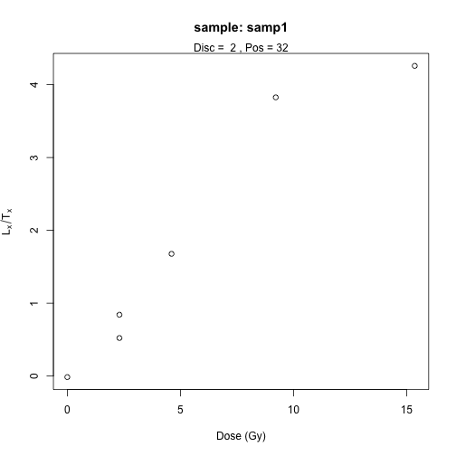
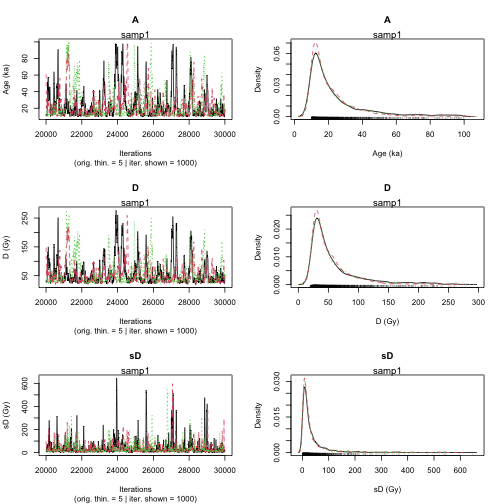
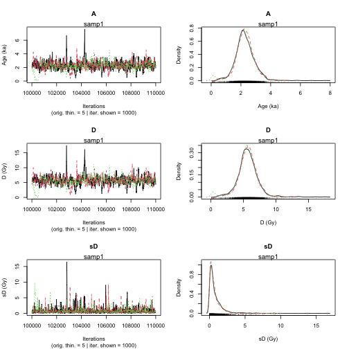
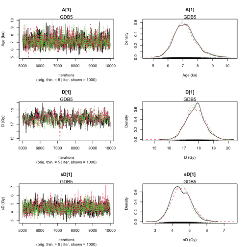
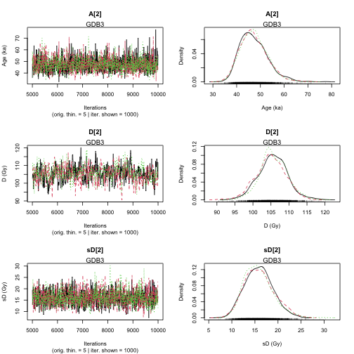
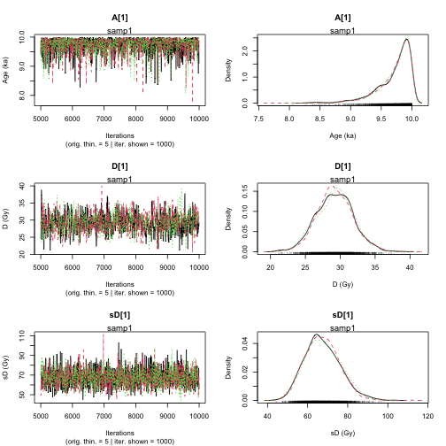
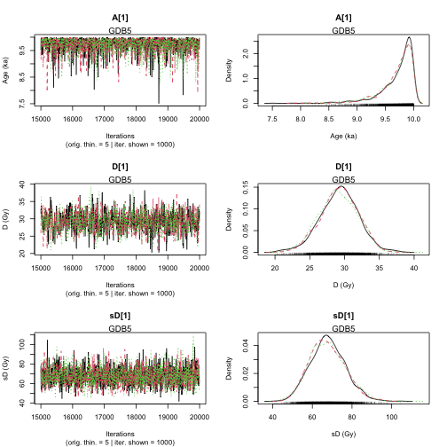
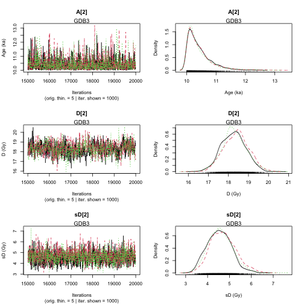

  


# Introduction

`'BayLum'` provides a collection of various **R** functions for Bayesian analysis of luminescence data. 
Amongst others, this includes data import, export, application of age models and palaeodose modelling.

Data can be processed simultaneously for various samples, including the input of multiple BIN/BINX-files per
sample for single grain (SG) or multi-grain (MG) OSL measurements. Stratigraphic constraints and 
systematic errors can be added to constrain the analysis further.

For those who already know how to use **R**, `'BayLum'` won't be difficult to use, 
for all others, this brief introduction may be of help to make the first steps with **R** and 
the package `'BayLum'` as convenient as possible. 

## Installing `BayLum' package

If you read this document before having installed **R** itself, you should first visit the 
[R project](https://www.r-project.org) website and download and install **R**. 
You may also consider installing [Rstudio](https://posit.co), 
which provides an excellent desktop working environment for **R**; however it is not 
a prerequisite.

You will also need the external software *JAGS* (Just Another Gibs Sampler). 
Please visit the [JAGS](https://mcmc-jags.sourceforge.io) webpage and follow the installation instructions. 
Now you are nearly ready to work with 'BayLum'. 

If you have not yet installed 'BayLum', please run the following two **R** code lines to 
install 'BayLum' on your computer.


``` r
install.packages("BayLum", dependencies = TRUE)
```

Alternatively, you can load an already installed **R** package (here 'BayLum') into your session by using 
the following **R** call.


``` r
library(BayLum)
```

# First steps: age analysis of one sample

Measurement data can be imported using two different options as detailed in the following: 

* Option 1: Using the conventional 'BayLum' folder structure (old)
* Option 2: Using a single-setting config file (new)

## Option 1: Import information from a BIN/BINX-file.

Let us consider the sample named *samp1*, which is the example dataset coming with the package. 
All information related to this sample is stored in a subfolder called also *samp1*.
To test the package example, first, we add the path of the example
dataset to the object `path`.


``` r
path <- paste0(system.file("extdata/", package = "BayLum"), "/")
```

Please note that for your own dataset (i.e. not included in the package)
you have to replace this call by something like:


``` r
path <- "Users/Master_of_luminescence/Documents/MyFamousOSLData"
```

In our example the folder contains the following subfolders and files:


|   |                          |
|:--|:-------------------------|
|1  |example.yml               |
|2  |FER1/bin.bin              |
|3  |FER1/Disc.csv             |
|4  |FER1/DoseEnv.csv          |
|5  |FER1/DoseSource.csv       |
|6  |FER1/rule.csv             |
|7  |samp1/bin.bin             |
|8  |samp1/DiscPos.csv         |
|9  |samp1/DoseEnv.csv         |
|10 |samp1/DoseSource.csv      |
|11 |samp1/rule.csv            |
|12 |samp2/bin.bin             |
|13 |samp2/DiscPos.csv         |
|14 |samp2/DoseEnv.csv         |
|15 |samp2/DoseSource.csv      |
|16 |samp2/rule.csv            |
|17 |yaml_config_reference.yml |

See *"What are the required files in each subfolder?"* in the manual of  `Generate_DataFile()` function
for the meaning of these files.

To import your data, simply call the function `Generate_DataFile()`:


``` r
DATA1 <-
  Generate_DataFile(
    Path = path,
    FolderNames = "samp1",
    Nb_sample = 1,
    verbose = FALSE)
```

```
Warning in Generate_DataFile(Path = path, FolderNames = "samp1", Nb_sample = 1, : 'Generate_DataFile' est obsolète.
Utilisez plutôt ‘create_DataFile()’.
Voir help("Deprecated")
```

### Remarks

#### Data import/export

The import may take a while, in particular for large BIN/BINX-files. This can become annoying if you want to play with the data. 
In such situations, it makes sense to save your imported data somewhere else before continuing. 

To save the obove imported data on your hardrive use


``` r
save(DATA1, file = "YourPath/DATA1.RData")
```

To load the data use


``` r
load(DATA1, file = "YourPath/DATA1.RData")
```

#### Data structure

To see the overall structure of the data generated from the BIN/BINX-file and the associated CSV-files,
the following call can be used:


``` r
str(DATA1)
```

```
List of 9
 $ LT            :List of 1
  ..$ : num [1, 1:7] 2.042 0.842 1.678 3.826 4.258 ...
 $ sLT           :List of 1
  ..$ : num [1, 1:7] 0.344 0.162 0.328 0.803 0.941 ...
 $ ITimes        :List of 1
  ..$ : num [1, 1:6] 15 30 60 100 0 15
 $ dLab          : num [1:2, 1] 1.53e-01 5.89e-05
 $ ddot_env      : num [1:2, 1] 2.512 0.0563
 $ regDose       :List of 1
  ..$ : num [1, 1:6] 2.3 4.6 9.21 15.35 0 ...
 $ J             : num 1
 $ K             : num 6
 $ Nb_measurement: num 16
```

It reveals that `DATA1` is basically a list with 9 elements:

Element                | Content |
---------------------- |---------------
`DATA1$LT`             | $L_x$/$T_x$ values from each sample |
`DATA1$sLT`            | $L_x$/$T_x$ error values from each sample |
`DATA1$ITimes`         | Irradiation times |
`DATA1$dLab`           | The lab dose rate |
`DATA1$ddot_env`       | The environmental dose rate and its variance |
`DATA1$regDose`        | The regenerated dose points |
`DATA1$J`              | The number of aliquots selected for each BIN-file |
`DATA1$K`              | The number of regenerated dose points |
`DATA1$Nb_measurement` | The number of measurements per BIN-file |

#### Visualise Lx/Tx values and dose points

To get an impression on how your data look like, you can visualise them by 
using the function `LT_RegenDose()`:


``` r
LT_RegenDose(
  DATA = DATA1,
  Path = path,
  FolderNames = "samp1",
  SampleNames = "samp1",
  Nb_sample = 1,
  nrow = NULL
)
```

```
Warning in LT_RegenDose(DATA = DATA1, Path = path, FolderNames = "samp1", : 'LT_RegenDose' est obsolète.
Utilisez plutôt ‘plot_RegDosePoints()’.
Voir help("Deprecated")
```

<div class="figure" style="text-align: center">

<p class="caption">plot of chunk unnamed-chunk-10</p>
</div>

Note that here we consider only one sample, and the name of the folder is the name of the sample.
For that reason the argumetns were set to `FolderNames = samp1` and `SampleNames = samp1`.

### Generate data file from BIN/BINX-files of multi-grain OSL measurements

For a multi-grain OSL measurements, instead of `Generate_DataFile()`, the function `Generate_DataFile_MG()` should
be used with similar parameters. The functions differ by their expectations: *Disc.csv* instead of *DiscPos.csv* file for Single-grain OSL Measurements.
Please check type `?Generate_DataFile_MG` for further information.

## Option 2: Import data using `create_DataFile()` 

With `'BayLum'` >= v0.3.2 we introduced a new function called `create_DataFile()`, which 
will at some point in time replace the function `Generate_DataFile()` and `Generate_DataFile_MG()`.
`create_DataFile()` works conceptionally very different from the approach detailed above. 
Key differences are: 

* The function uses a single configuration file for all samples and all measurement files
* The very error prone subfolder structure is no longer needed
* Measurement data can be imported with `create_DataFile()`, but also outside of the function 
and then passed on the functions. This enables the possibility of extensive pre-processing 
and selection of measurement data. 

The configuration follows the so-called [YAML format](https://yaml.org) specification. 
For single sample the file looks as follows:

```
- sample: "samp1"
files: null
settings:
dose_source: { value: 0.1535, error: 0.00005891 }
dose_env: { value: 2.512, error: 0.05626 }
rules:
beginSignal: 6
endSignal: 8
beginBackground: 50
endBackground: 55
beginTest: 6
endTest: 8
beginTestBackground: 50
endTestBackground: 55
inflatePercent: 0.027
nbOfLastCycleToRemove: 1
```

In the case above, the configuration file assumes that data for `samp1` are
already imported and treated and a R object called `samp1` is available in the global 
environment. The following example code reproduces this case:


``` r
## get example file path from package
yaml_file <- system.file("extdata/example.yml", package = "BayLum")
samp1_file <- system.file("extdata/samp1/bin.bin", package = "BayLum")

## read YAML manually and select only the first record 
config_file <- yaml::read_yaml(yaml_file)[[1]]

## import BIN/BINX files and select position 2 and grain 32 only
samp1 <- Luminescence::read_BIN2R(samp1_file, verbose = FALSE) |>
  subset(POSITION == 2 & GRAIN == 32)

## create the data file
DATA1 <- create_DataFile(config_file, verbose = FALSE)
```

## Age computation 

To compute the age of the sample *samp1*, you can run the following code:


``` r
Age <- Age_Computation(
  DATA = DATA1,
  SampleName = "samp1",
  PriorAge = c(10, 100),
  distribution = "cauchy",
  LIN_fit = TRUE,
  Origin_fit = FALSE,
  Iter = 10000
)
```

```
Compiling model graph
   Resolving undeclared variables
   Allocating nodes
Graph information:
   Observed stochastic nodes: 6
   Unobserved stochastic nodes: 9
   Total graph size: 139

Initializing model
```

<div class="figure" style="text-align: center">

<p class="caption">plot of chunk unnamed-chunk-12</p>
</div>

```


>> Sample name <<
----------------------------------------------
samp1

>> Results of the Gelman and Rubin criterion of convergence <<
----------------------------------------------
	 Point estimate Uppers confidence interval
A	 1.043 		 1.102 
D	 1.042 		 1.098 
sD	 1.036 		 1.058 


---------------------------------------------------------------------------------------------------
 *** WARNING: The following information are only valid if the MCMC chains have converged  ***
---------------------------------------------------------------------------------------------------

parameter 	 Bayes estimate 	  Credible interval 
----------------------------------------------
A 		 25.061 
						 lower bound 	 upper bound
				 at level 95%	 10 		 50.294 
				 at level 68%	 10 		 21.841 
----------------------------------------------
D 		 62.212 
						 lower bound 	 upper bound
				 at level 95%	 19.675 		 125.768 
				 at level 68%	 22.385 		 55.487 
----------------------------------------------
sD 		 44.674 
						 lower bound 	 upper bound
				 at level 95%	 0.15 		 126.445 
				 at level 68%	 0.263 		 28.94 
```

This also works if `DATA1` is the output of `Generate_DataFile_MG()`.

##### Remark 1: MCMC trajectories

- If MCMC trajectories did not converge, you can add more iteration with the parameter `Iter` in the function `Age_Computation()`,
for example `Iter = 20000` or `Iter = 50000`. If it is not desirable to re-run the model from scratch, read the 
- To increase the precision of prior distribution, if not specified before you can use the argument `PriorAge`. 
For example: `PriorAge= c(0.01,10)` for a young sample and `PriorAge = c(10,100)` for an old sample.
- If the trajectories are still not convergering, you should whether the choice you made with the argument `distribution` and 
dose-response curves are meaningful.

##### Remark 2: `LIN_fit` and `Origin_fit`, dose-response curves option

- By default, a saturating exponential plus linear dose response curve is expected. However, you choose other formula by changing arguments
`LIN_fit` and `Origin_fit` in the function.

##### Remark 3: `distribution`, equivalent dose dispersion option

By default, a *cauchy* distribution is assumed, but you can choose another distribution by replacing the
word `cauchy` by `gaussian`, `lognormal_A` or `lognormal_M` for the argument `distribution`.

The difference between the models: *lognormal_A* and *lognormal_M* is that the equivalent dose dispersion
are distributed according to:

- a log-normal distribution with mean or average equal to the palaeodose for the first model
- a log-normal distribution with median equal to the palaeodose for the second model.

##### Remark 4: `SavePdf` and `SaveEstimates` option

These two arguments allow to save the results to files.

- `SavePdf = TRUE` create a PDF-file with MCMC trajectories of parameters `A` (age), `D` (palaeodose), `sD` (equivalent doses dispersion).
You have to specify `OutputFileName` and `OutputFilePath` to define name and path of the PDF-file.
- `SaveEstimates = TRUE` saves a CSV-file containing the Bayes estimates, the credible interval at 68\% and 95\%  and the Gelman and Rudin test of
convergence of the parameters `A`, `D`, `sD`. For the export the arguments `OutputTableName` and `OutputTablePath` have to be specified.

##### Remark 4: `PriorAge` option

By default, an age between 0.01 ka and 100 ka is expected.
If the user has more informations on the sample, `PriorAge` should be modified accordingly.

For example, if you know that the sample is an older, you can set `PriorAge=c(10,120)`. In contrast, if you know that the sample is younger,
you may want to set `PriorAge=c(0.001,10)`. Ages of $<=0$ are not possible. The minimum bound is 0.001.

**Please note that the setting of `PriorAge` is not trivial, wrongly set boundaries are likely biasing
your results.**

## Multiple BIN/BINX-files for one sample

In the previous example we considered only the simplest case: one sample, and one BIN/BINX-file.
However, 'BayLum' allows to process multiple BIN/BINX-files for one sample.
To work with multiple BIN/BINX-files, the names of the subfolders need to beset in argument `Names` and
both files need to be located unter the same `Path`.

For the case


``` r
Names <- c("samp1", "samp2")
```

the call `Generate_DataFile()` (or `Generate_DataFile_MG()`) becomes as follows:


``` r
##argument setting
nbsample <- 1
nbbinfile <- length(Names)
Binpersample <- c(length(Names))

##call data file generator
DATA_BF <- Generate_DataFile(
  Path = path,
  FolderNames = Names,
  Nb_sample = nbsample,
  Nb_binfile = nbbinfile,
  BinPerSample = Binpersample,
  verbose = FALSE
)
```

```
Warning in Generate_DataFile(Path = path, FolderNames = Names, Nb_sample = nbsample, : 'Generate_DataFile' est obsolète.
Utilisez plutôt ‘create_DataFile()’.
Voir help("Deprecated")
```

``` r
##calculate the age
Age <- Age_Computation(
  DATA = DATA_BF,
  SampleName = Names,
  BinPerSample = Binpersample
)
```

```
Compiling model graph
   Resolving undeclared variables
   Allocating nodes
Graph information:
   Observed stochastic nodes: 12
   Unobserved stochastic nodes: 15
   Total graph size: 221

Initializing model
```

<div class="figure" style="text-align: center">

<p class="caption">plot of chunk unnamed-chunk-14</p>
</div>

```


>> Sample name <<
----------------------------------------------
samp1 samp2

>> Results of the Gelman and Rubin criterion of convergence <<
----------------------------------------------
	 Point estimate Uppers confidence interval
A	 1.018 		 1.023 
D	 1.022 		 1.027 
sD	 1.044 		 1.057 


---------------------------------------------------------------------------------------------------
 *** WARNING: The following information are only valid if the MCMC chains have converged  ***
---------------------------------------------------------------------------------------------------

parameter 	 Bayes estimate 	  Credible interval 
----------------------------------------------
A 		 2.312 
						 lower bound 	 upper bound
				 at level 95%	 0.86 		 3.819 
				 at level 68%	 1.65 		 2.728 
----------------------------------------------
D 		 5.75 
						 lower bound 	 upper bound
				 at level 95%	 2.602 		 9.545 
				 at level 68%	 4.453 		 6.886 
----------------------------------------------
sD 		 0.881 
						 lower bound 	 upper bound
				 at level 95%	 0.003 		 3.318 
				 at level 68%	 0.003 		 0.846 
```

# Age analysis of various samples

## Generate data file from BIN/BINX-files

The function `Generate_DataFile()`  (or `Generate_DataFile_MF()`) can process multiple files
simultaneously including multiple BIN/BINX-files per sample. 

We assume that we are interested in two samples named: *sample1* and *sample2*. In addition, we have 
two BIN/BINX-files for the first sample named: *sample1-1* and *sample1-2*, and one BIN-file for the 2nd sample named *sample2-1*.
In such case, we need three subfolders named *sample1-1*, *sample1-2* and *sample2-1*;
which each subfolder containing only one BIN-file named **bin.bin**, and its associated files **DiscPos.csv**, **DoseEnv.csv**, **DoseSourve.csv** and **rule.csv**.
All of these 3 subfolders must be located in *path*.

To fill the argument corectly `BinPerSample`: $binpersample=c(\underbrace{2}_{\text{sample 1: 2 bin files}},\underbrace{1}_{\text{sample 2: 1 bin file}})$


``` r
Names <-
  c("sample1-1", "sample1-2", "sample2-1") # give the name of the folder datat
nbsample <- 2    # give the number of samples
nbbinfile <- 3   # give the number of bin files
DATA <- Generate_DataFile(
  Path = path,
  FolderNames = Names,
  Nb_sample = nbsample,
  Nb_binfile = nbbinfile,
  BinPerSample = binpersample
)
```

### Combine files using the function `combine_DataFiles()`

If the user has already saved informations imported with `Generate_DataFile()` function  (or `Generate_DataFile_MG()` function) 
these data can be concatenate with the function `combine_DataFiles()`.

For example, if `DATA1` is the output of sample named "GDB3", and `DATA2` is the output of sample "GDB5",
both data can be merged with the following call:


``` r
data("DATA1", envir = environment())
data("DATA2", envir = environment())
DATA3 <- combine_DataFiles(L1 = DATA2, L2 = DATA1)
str(DATA3)
```

```
List of 11
 $ LT            :List of 2
  ..$ : num [1:188, 1:6] 4.54 2.73 2.54 2.27 1.48 ...
  ..$ : num [1:101, 1:6] 5.66 6.9 4.05 3.43 4.97 ...
 $ sLT           :List of 2
  ..$ : num [1:188, 1:6] 0.333 0.386 0.128 0.171 0.145 ...
  ..$ : num [1:101, 1:6] 0.373 0.315 0.245 0.181 0.246 ...
 $ ITimes        :List of 2
  ..$ : num [1:188, 1:5] 40 40 40 40 40 40 40 40 40 40 ...
  ..$ : num [1:101, 1:5] 160 160 160 160 160 160 160 160 160 160 ...
 $ dLab          : num [1:2, 1:2] 1.53e-01 5.89e-05 1.53e-01 5.89e-05
 $ ddot_env      : num [1:2, 1:2] 2.512 0.0563 2.26 0.0617
 $ regDose       :List of 2
  ..$ : num [1:188, 1:5] 6.14 6.14 6.14 6.14 6.14 6.14 6.14 6.14 6.14 6.14 ...
  ..$ : num [1:101, 1:5] 24.6 24.6 24.6 24.6 24.6 ...
 $ J             : num [1:2] 188 101
 $ K             : num [1:2] 5 5
 $ Nb_measurement: num [1:2] 14 14
 $ SampleNames   : chr [1:2] "samp 1" "samp 1"
 $ Nb_sample     : num 2
 - attr(*, "originator")= chr "create_DataFile"
```

The data structure should become as follows

- 2 `list`s (1 `list` per sample) for `DATA$LT`, `DATA$sLT`, `DATA1$ITimes` and `DATA1$regDose`
- A `matrix` with 2 columns (1 line per sample) for `DATA1$dLab`, `DATA1$ddot_env`
- 2 `integer`s (1 `integer` per BIN files here we have 1 BIN-file per sample) for `DATA1$J`, `DATA1$K`, `DATA1$Nb_measurement`.

Single-grain and multiple-grain OSL measurements can be merged in the same way.
To plot the $L/T$ as a function of the regenerative dose the function `LT_RegenDose()` can be
used again:


``` r
plot_RegDosePoints(DATA3)
```

*Note: In the example `DATA3` contains information from the samples 'GDB3' and 'GDB5', which are single-grain OSL measurements. For a correct treatment the argument `SG` has to be manually set by the user. Please see the function manual for further details.*

## Age analysis without stratigraphic constraints

If no stratigraphic constraints were set, the following code can be used to analyse the age of the sample *GDB5* and *GDB3* simultaneously.


``` r
priorage = c(1, 10, 10, 100)
Age <- AgeS_Computation(
  DATA = DATA3,
  Nb_sample = 2,
  SampleNames = c("GDB5", "GDB3"),
  PriorAge = priorage,
  distribution = "cauchy",
  LIN_fit = TRUE,
  Origin_fit = FALSE,
  Iter = 1000, 
  jags_method = "rjags"
)
```

```
Warning: No initial values were provided - JAGS will use the same initial values for all chains
```

```
Compiling rjags model...
Calling the simulation using the rjags method...
Adapting the model for 1000 iterations...
Running the model for 5000 iterations...
Simulation complete
Calculating summary statistics...
Calculating the Gelman-Rubin statistic for 6 variables....
Finished running the simulation
```

<div class="figure" style="text-align: center">

<p class="caption">plot of chunk unnamed-chunk-18</p>
</div><div class="figure" style="text-align: center">

<p class="caption">plot of chunk unnamed-chunk-18</p>
</div>

```


>> Results of the Gelman and Rubin criterion of convergence <<
----------------------------------------------
 Sample name:  GDB5 
---------------------
		 Point estimate Uppers confidence interval
A_GDB5 	 1.002 		 1.005 
D_GDB5 	 1.003 		 1.012 
sD_GDB5 	 1.006 		 1.021 
----------------------------------------------
 Sample name:  GDB3 
---------------------
		 Point estimate Uppers confidence interval
A_GDB3 	 1 		 1 
D_GDB3 	 1.001 		 1.002 
sD_GDB3 	 1.001 		 1.005 


---------------------------------------------------------------------------------------------------
 *** WARNING: The following information are only valid if the MCMC chains have converged  ***
---------------------------------------------------------------------------------------------------


>> Bayes estimates of Age, Palaeodose and its dispersion for each sample and credible interval <<
----------------------------------------------
 Sample name:  GDB5 
---------------------
Parameter 	 Bayes estimate 	  Credible interval 
 A_GDB5 	 7.132 
						 lower bound 	 upper bound
				 at level 95% 	 5.783 		 8.596 
				 at level 68% 	 6.298 		 7.677 

Parameter 	 Bayes estimate 	  Credible interval 
 D_GDB5 	 17.798 
						 lower bound 	 upper bound
				 at level 95% 	 16.725 		 19.004 
				 at level 68% 	 17.145 		 18.332 

Parameter 	 Bayes estimate 	  Credible interval 
sD_GDB5 	 4.53 
						 lower bound 	 upper bound
				 at level 95% 	 3.544 		 5.782 
				 at level 68% 	 4.028 		 5.142 
----------------------------------------------
 Sample name:  GDB3 
---------------------
Parameter 	 Bayes estimate 	  Credible interval 
 A_GDB3 	 46.979 
						 lower bound 	 upper bound
				 at level 95% 	 36.343 		 57.758 
				 at level 68% 	 40.774 		 51.082 

Parameter 	 Bayes estimate 	  Credible interval 
 D_GDB3 	 104.689 
						 lower bound 	 upper bound
				 at level 95% 	 96.694 		 112.104 
				 at level 68% 	 101.184 		 108.653 

Parameter 	 Bayes estimate 	  Credible interval 
sD_GDB3 	 16.236 
						 lower bound 	 upper bound
				 at level 95% 	 9.985 		 21.678 
				 at level 68% 	 12.11 		 18.146 

----------------------------------------------
```

<div class="figure" style="text-align: center">

<p class="caption">plot of chunk unnamed-chunk-18</p>
</div>

**Note:** For an automated parallel processing you can set the argument `jags_method = "rjags"` to `jags_method = "rjparallel"`.

### Remarks

As for the function `Age_computation()`, the age for each sample is set by default between 0.01 ka and 100 ka.
If you have more informations on your samples it is possible to change `PriorAge` parameters.
`PriorAge` is a vector of `size = 2*$Nb_sample`, the two first values of `PriorAge`
concern the 1st sample, the next two values the 2nd sample  and so on.

For example, if you know that sample named *GDB5* is a young sample whose its age is between 0.01 ka and 10 ka,
and *GDB3* is an old sample whose age is between 10 ka and 100 ka,
$$PriorAge=c(\underbrace{0.01,10}_{GDB5\ prior\ age},\underbrace{10,100}_{GDB3\ prior\ age})$$

## Age analysis with stratigraphic constraints

With the function `AgeS_Computation()` it is possible to take the stratigraphic
relations between samples into account and define constraints.

For example, we know that *GDB5* is in a higher stratigraphical position, hence it likely has 
a younger age than sample *GDB3*.

### Ordering samples

To take into account stratigraphic constraints, the information on the samples need to be ordered.
Either you enter a sample name (corresponding to subfolder names) in `Names` parameter of the function `Generate_DataFile()`, ordered by order of increasing ages or you enter saved .RData informations of each sample in `combine_DataFiles()`, ordered by increasing ages.


``` r
# using Generate_DataFile function
Names <- c("samp1", "samp2")
nbsample <- 2
DATA3 <- Generate_DataFile(
  Path = path,
  FolderNames = Names,
  Nb_sample = nbsample,
  verbose = FALSE
)
```

```
Warning in Generate_DataFile(Path = path, FolderNames = Names, Nb_sample = nbsample, : 'Generate_DataFile' est obsolète.
Utilisez plutôt ‘create_DataFile()’.
Voir help("Deprecated")
```


``` r
# using the function combine_DataFiles()
data(DATA1, envir = environment()) # .RData on sample GDB3
data(DATA2, envir = environment()) # .RData on sample GDB5
DATA3 <- combine_DataFiles(L1 = DATA1, L2 = DATA2)
```

### Define matrix to set stratigraphic constraints

Let `SC` be the matrix containing all information on stratigraphic relations for this two samples.
This matrix is defined as follows:

- matrix dimensions: the row number of `StratiConstraints` matrix is equal to `Nb_sample+1`,
and column number is equal to $Nb\_sample$.

- first matrix row: for all $i$ in $\{1,...,Nb\_Sample\}$, `StratiConstraints[1,i] <- 1`,
means that the lower bound of the sample age given in `PriorAge[2i-1]` for the sample whose number ID
is equal to $i$ is taken into account

- sample relations: for all $j$ in $\{2,...,Nb\_Sample+1}\$ and all $i$ in $\{j,...,Nb\_Sample\}$,
`StratiConstraints[j,i] <- 1` if the sample age whose ID is equal to $j-1$ is lower than the sample age whose ID is equal to $i$.
Otherwise, `StratiConstraints[j,i] <- 0`.

To the define such matrix the function *SCMatrix()* can be used:


``` r
SC <- SCMatrix(Nb_sample = 2,
               SampleNames = c("samp1", "samp2"))
```

In our case: 2 samples, `SC` is a matrix with 3 rows and 2 columns. The first row contains `c(1,1)` (because we take into account the prior ages), the second line contains `c(0,1)` (sample 2, named *samp2* is supposed to be older than sample 1, named *samp1*) and the third line contains `c(0,0)` (sample 2, named *samp2* is not younger than the sample 1, here named *samp1*). We can also fill the matrix with the stratigraphic relations as follow:


``` r
SC <- matrix(
  data = c(1, 1, 0, 1, 0, 0),
  ncol = 2,
  nrow = (2 + 1),
  byrow = T
)
```

### Age computation


``` r
Age <-
  AgeS_Computation(
    DATA = DATA3,
    Nb_sample = 2,
    SampleNames = c("samp1", "samp2"),
    PriorAge = priorage,
    distribution = "cauchy",
    LIN_fit = TRUE,
    Origin_fit = FALSE,
    StratiConstraints = SC,
    Iter = 1000, 
    jags_method = 'rjags')
```

```
Warning: No initial values were provided - JAGS will use the same initial values for all chains
```

```
Compiling rjags model...
Calling the simulation using the rjags method...
Adapting the model for 1000 iterations...
Running the model for 5000 iterations...
Simulation complete
Calculating summary statistics...
Calculating the Gelman-Rubin statistic for 6 variables....
Finished running the simulation
```

<div class="figure" style="text-align: center">

<p class="caption">plot of chunk unnamed-chunk-23</p>
</div><div class="figure" style="text-align: center">

<p class="caption">plot of chunk unnamed-chunk-23</p>
</div>

```


>> Results of the Gelman and Rubin criterion of convergence <<
----------------------------------------------
 Sample name:  samp1 
---------------------
		 Point estimate Uppers confidence interval
A_samp1 	 1.003 		 1.005 
D_samp1 	 1 		 1.002 
sD_samp1 	 1.003 		 1.009 
----------------------------------------------
 Sample name:  samp2 
---------------------
		 Point estimate Uppers confidence interval
A_samp2 	 1.004 		 1.008 
D_samp2 	 1.005 		 1.017 
sD_samp2 	 1.002 		 1.01 


---------------------------------------------------------------------------------------------------
 *** WARNING: The following information are only valid if the MCMC chains have converged  ***
---------------------------------------------------------------------------------------------------


>> Bayes estimates of Age, Palaeodose and its dispersion for each sample and credible interval <<
----------------------------------------------
 Sample name:  samp1 
---------------------
Parameter 	 Bayes estimate 	  Credible interval 
 A_samp1 	 9.711 
						 lower bound 	 upper bound
				 at level 95% 	 9.126 		 10 
				 at level 68% 	 9.677 		 10 

Parameter 	 Bayes estimate 	  Credible interval 
 D_samp1 	 29.26 
						 lower bound 	 upper bound
				 at level 95% 	 23.914 		 34.493 
				 at level 68% 	 26.756 		 32.052 

Parameter 	 Bayes estimate 	  Credible interval 
sD_samp1 	 67.869 
						 lower bound 	 upper bound
				 at level 95% 	 51.164 		 84.839 
				 at level 68% 	 57.714 		 74.182 
----------------------------------------------
 Sample name:  samp2 
---------------------
Parameter 	 Bayes estimate 	  Credible interval 
 A_samp2 	 10.413 
						 lower bound 	 upper bound
				 at level 95% 	 10 		 11.236 
				 at level 68% 	 10 		 10.469 

Parameter 	 Bayes estimate 	  Credible interval 
 D_samp2 	 18.343 
						 lower bound 	 upper bound
				 at level 95% 	 17.089 		 19.48 
				 at level 68% 	 17.62 		 18.846 

Parameter 	 Bayes estimate 	  Credible interval 
sD_samp2 	 4.619 
						 lower bound 	 upper bound
				 at level 95% 	 3.588 		 5.669 
				 at level 68% 	 4.003 		 5.09 

----------------------------------------------
```

<div class="figure" style="text-align: center">

<p class="caption">plot of chunk unnamed-chunk-23</p>
</div>

Thee results can be also be used for an alternative graphical representation: 


``` r
plot_Ages(Age, plot_mode = "density")
```

<div class="figure" style="text-align: center">

<p class="caption">plot of chunk unnamed-chunk-24</p>
</div>

```
  SAMPLE    AGE HPD68.MIN HPD68.MAX HPD95.MIN HPD95.MAX ALT_SAMPLE_NAME AT
1  samp1  9.711     9.677    10.000     9.126    10.000              NA  2
2  samp2 10.413    10.000    10.469    10.000    11.236              NA  1
```

## When MCMC trajectories did not converge

If MCMC trajectories did not converge, it means we should run additional MCMC iterations.  
For `AgeS_computation()` and `Age_OSLC14()` models we can run additional iterations by supplying the function output back into the parent function.
In the following, notice we are using the output of the previous `AgeS_computation()` example, namely `Age`. The key argument to set/change is `DATA`.


``` r
Age <- AgeS_Computation(
  DATA = Age,
  Nb_sample = 2,
  SampleNames = c("GDB5", "GDB3"),
  PriorAge = priorage,
  distribution = "cauchy",
  LIN_fit = TRUE,
  Origin_fit = FALSE,
  Iter = 1000, 
  jags_method = "rjags"
)
```

```
Calling the simulation using the rjags method...
Note: the model did not require adaptation
Burning in the model for 4000 iterations...
Running the model for 5000 iterations...
Simulation complete
Calculating summary statistics...
Calculating the Gelman-Rubin statistic for 6 variables....
Finished running the simulation
```

<div class="figure" style="text-align: center">

<p class="caption">plot of chunk unnamed-chunk-25</p>
</div><div class="figure" style="text-align: center">

<p class="caption">plot of chunk unnamed-chunk-25</p>
</div>

```


>> Results of the Gelman and Rubin criterion of convergence <<
----------------------------------------------
 Sample name:  GDB5 
---------------------
		 Point estimate Uppers confidence interval
A_GDB5 	 1 		 1 
D_GDB5 	 1.001 		 1.004 
sD_GDB5 	 1.001 		 1.005 
----------------------------------------------
 Sample name:  GDB3 
---------------------
		 Point estimate Uppers confidence interval
A_GDB3 	 1.008 		 1.012 
D_GDB3 	 1.009 		 1.031 
sD_GDB3 	 1.007 		 1.026 


---------------------------------------------------------------------------------------------------
 *** WARNING: The following information are only valid if the MCMC chains have converged  ***
---------------------------------------------------------------------------------------------------


>> Bayes estimates of Age, Palaeodose and its dispersion for each sample and credible interval <<
----------------------------------------------
 Sample name:  GDB5 
---------------------
Parameter 	 Bayes estimate 	  Credible interval 
 A_GDB5 	 9.724 
						 lower bound 	 upper bound
				 at level 95% 	 9.154 		 10 
				 at level 68% 	 9.687 		 10 

Parameter 	 Bayes estimate 	  Credible interval 
 D_GDB5 	 29.372 
						 lower bound 	 upper bound
				 at level 95% 	 23.658 		 34.505 
				 at level 68% 	 26.635 		 32.055 

Parameter 	 Bayes estimate 	  Credible interval 
sD_GDB5 	 67.561 
						 lower bound 	 upper bound
				 at level 95% 	 50.632 		 84.409 
				 at level 68% 	 59.654 		 76.278 
----------------------------------------------
 Sample name:  GDB3 
---------------------
Parameter 	 Bayes estimate 	  Credible interval 
 A_GDB3 	 10.406 
						 lower bound 	 upper bound
				 at level 95% 	 10 		 11.176 
				 at level 68% 	 10 		 10.468 

Parameter 	 Bayes estimate 	  Credible interval 
 D_GDB3 	 18.29 
						 lower bound 	 upper bound
				 at level 95% 	 17.184 		 19.532 
				 at level 68% 	 17.675 		 18.837 

Parameter 	 Bayes estimate 	  Credible interval 
sD_GDB3 	 4.557 
						 lower bound 	 upper bound
				 at level 95% 	 3.526 		 5.591 
				 at level 68% 	 3.975 		 5.059 

----------------------------------------------
```

<div class="figure" style="text-align: center">

<p class="caption">plot of chunk unnamed-chunk-25</p>
</div>

# References {-}

Combès, B., Philippe, A., Lanos, P., Mercier, N., Tribolo, C., Guerin, G., Guibert, P., Lahaye, C., 2015.
A Bayesian central equivalent dose model for optically stimulated luminescence dating. 
Quaternary Geochronology 28, 62-70. doi: [10.1016/j.quageo.2015.04.001](https://doi.org/10.1016/j.quageo.2015.04.001)

Combès, B., Philippe, A., 2017. Bayesian analysis of individual and systematic multiplicative errors for estimating ages with stratigraphic constraints in optically stimulated luminescence dating. Quaternary Geochronology 39, 24–34. doi: [10.1016/j.quageo.2017.02.003](https://doi.org/10.1016/j.quageo.2017.02.003)

Philippe, A., Guérin, G., Kreutzer, S., 2019. BayLum - An R package for Bayesian analysis of OSL ages: An introduction. Quaternary Geochronology 49, 16-24. doi: [10.1016/j.quageo.2018.05.009](https://doi.org/10.1016/j.quageo.2018.05.009)

## Further reading {-}

### For more details on the diagnostic of Markov chains {-}

Robert and Casella, 2009. Introducing Monte Carlo Methods with R. Springer Science & Business Media.

### For details on the here used dataset {-}

Tribolo, C., Asrat, A., Bahain, J. J., Chapon, C., Douville, E., Fragnol, C., Hernandez, M., Hovers, E., Leplongeon, A., Martin, L., Pleurdeau, D., Pearson, O., Puaud, S., Assefa, Z., 2017. Across the Gap: Geochronological and Sedimentological Analyses from the Late Pleistocene-Holocene Sequence of Goda Buticha, Southeastern Ethiopia. PloS one, 12(1), e0169418.
doi: [10.1371/journal.pone.0169418](https://doi.org/10.1371/journal.pone.0169418)
